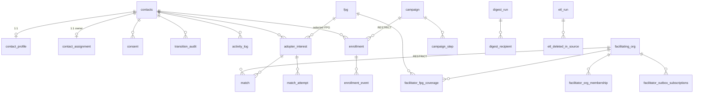

# JP ADOPT Core — Data Dictionary

| | |
|---|---|
| **Database** | PostgreSQL (system of record) |
| **System of record** | `apps/api/src/jp_adopt_api/models.py` (SQLAlchemy 2). Schema changes ship as Alembic migrations under `apps/api/alembic/versions/`. Update the model, then this file. |
| **Schema version** | Migration head `20260618_0028_staff_profile` |
| **Last updated** | 2026-06-24 |
| **Maintained in** | `jp-adopt-core/docs/data-dictionary.md`, mirrored to the knowledge base under `content/architecture/`. |

## 1. Overview

JP ADOPT is the greenfield CRM that replaces the Disciple.Tools (DT) adoption workflow. Postgres is the system of record; an ARQ worker drains an outbox table to deliver webhooks and run drip email. The schema falls into six domains:

| Domain | Tables |
|--------|--------|
| **A. Contacts & CRM core** | `contacts`, `contact_profile`, `consent`, `contact_assignment`, `transition_audit`, `activity_log`, `submissions_blocked` |
| **B. Matching** | `facilitating_org`, `fpg`, `facilitator_fpg_coverage`, `adopter_interest`, `match`, `match_attempt`, `facilitator_org_membership`, `facilitator_outbox_subscriptions` |
| **C. Identity, auth & roles** | `roles`, `user_roles`, `staff_profile`, `identity_link`, `magic_link_token`, `magic_link_rate_limit`, `staff_identity_link`, `partner_tenants` |
| **D. Integration: outbox, ETL & intake** | `outbox`, `migration_conflicts`, `etl_run`, `etl_deleted_in_source`, `api_idempotency_keys`, `intake_api_key` |
| **E. Drip campaigns / email** | `campaign`, `campaign_step`, `enrollment`, `enrollment_event`, `suppression_list` |
| **F. Daily digest** | `digest_run`, `digest_recipient` |

### Cross-cutting conventions

- **Identity is external.** There is no `users` table. Staff are authenticated by **Azure AD B2C**; the database stores only the B2C **subject id** as a bare `text` value (`user_subject_id`, `b2c_subject_id`, `actor_id`, `decided_by`, …). `roles` + `user_roles` map a subject id to roles.
- **`contacts.version` is an optimistic lock.** The match/transition state machine gates on it. Mutable side data (`contact_profile`, `contact_assignment`, `consent`) is deliberately split into separate tables so editing it does **not** bump `version`.
- **Source provenance.** Tables that the DT ETL imports carry `source_system` + `source_id`, with a **partial unique index** (`WHERE source_id IS NOT NULL`) so the ETL can `ON CONFLICT` upsert while locally-created rows stay unconstrained. `source_system = 'local'` (or NULL) means the row originated in JP ADOPT.
- **PII minimisation.** Emails used as keys are stored as `email_normalized`; suppression and consent store **SHA-256 hex digests**, not raw values. Magic-link and intake-API tokens are stored as hashes only.
- **Timestamps** are `timestamptz` (`DateTime(timezone=True)`); `created_at`/`updated_at` default to `now()`, `updated_at` has an `onupdate` trigger.
- **Primary keys** are `uuid` (`uuid4`) unless noted (`fpg`, `suppression_list`, and the composite-key link tables differ; `enrollment_event` uses `bigint` identity).

## 2. Entity-relationship diagram (core relationships)

> `outbox`, `roles`/`user_roles`, the magic-link tables, `partner_tenants`, `migration_conflicts`, `api_idempotency_keys`, `intake_api_key`, `staff_profile`, `staff_identity_link`, `suppression_list` and `submissions_blocked` are standalone or keyed by string subject ids, so they are omitted from the diagram.

---

## 3. Domain A — Contacts & CRM core

### 3.1 `contacts` — Party record (the CRM hub)

A person or organisation (the `party_kind`). The optimistic-lock `version` column guards the match/transition flows.

| Column | Type | Null | Default | Key | Description |
|--------|------|------|---------|-----|-------------|
| `id` | uuid | NO | uuid4 | PK | |
| `party_kind` | varchar(64) | NO | | | Kind of party (e.g. person / organisation). |
| `display_name` | varchar(512) | NO | | | Display name. |
| `adopter_status` | varchar(128) | YES | | CHECK | Adopter pipeline state. See §9. |
| `facilitator_status` | varchar(128) | YES | | CHECK | Facilitator pipeline state. See §9. |
| `version` | integer | NO | 1 | | Optimistic-lock version; bumped on guarded mutations. |
| `b2c_subject_id` | text | YES | | INDEX | Azure AD B2C subject id, if this contact has signed in. |
| `email_normalized` | text | YES | | partial UNIQUE | Normalised email; unique where not null. |
| `phone` | varchar(64) | YES | | | Phone. |
| `source_system` | text | YES | | INDEX | Origin system (e.g. `dt`); null/`local` for native rows. |
| `source_id` | text | YES | | partial UNIQUE | Id in the source system; unique with `source_system` where both set. |
| `local_modified_after_import` | boolean | NO | false | | True if a `dt`-imported row was edited locally (conflict tracking). |
| `origin` | text | YES | | | Free-form origin label. |
| `newsletter_opt_in` | boolean | NO | false | | Newsletter consent. |
| `country_code` | text | YES | | | Country code. |
| `language_codes` | text[] | YES | | | Spoken languages. |
| `created_at` | timestamptz | NO | now() | | |
| `updated_at` | timestamptz | NO | now() (onupdate) | | |

**Constraints:** `ck_contacts_adopter_status`, `ck_contacts_facilitator_status` (see §9).
**Indexes:** `b2c_subject_id`; `(source_system, source_id)`; partial unique `email_normalized`; partial unique `(source_system, source_id)`.

---

### 3.2 `contact_profile` — Adoption-field profile (1:1)

The JP-custom `dt-adoption-fields` plugin fields, split off `contacts` so profile edits don't churn `contacts.version`. All columns nullable; organised by UI "tile".

| Column | Type | Null | Default | Key | Description |
|--------|------|------|---------|-----|-------------|
| `id` | uuid | NO | uuid4 | PK | |
| `contact_id` | uuid | NO | | FK → `contacts.id` (CASCADE), UNIQUE | Owner contact (1:1). |
| `ministry_areas` | text[] | YES | | | *contact_info tile.* |
| `entity_size` | text | YES | | CHECK | Org size bucket. See §9. |
| `primary_contact_name` | text | YES | | | |
| `secondary_contact_name` | text | YES | | | |
| `secondary_contact_email` | text | YES | | | |
| `secondary_contact_phone` | text | YES | | | |
| `website` | text | YES | | | |
| `preferred_communication` | text | YES | | CHECK | `email` / `phone`. |
| `form_country` | text | YES | | | |
| `form_state_region` | text | YES | | | |
| `adopter_type` | text | YES | | CHECK | *adoption_profile tile.* See §9. |
| `commitment_types` | text[] | YES | | | |
| `commitment_date` | date | YES | | | |
| `works_with_fpgs` | boolean | YES | | | *facilitation_profile tile.* |
| `willing_to_facilitate` | boolean | YES | | | |
| `facilitation_entity_types` | text[] | YES | | | |
| `facilitation_entity_sizes` | text[] | YES | | | |
| `mou_status` | text | YES | | CHECK | `signed` / `not_required` / `not_sent`. |
| `mou_signature_name` | text | YES | | | |
| `want_facilitator_connection` | boolean | YES | | | *connection_prefs tile.* |
| `facilitator_entity_types` | text[] | YES | | | |
| `desired_facilitator_info` | text[] | YES | | | |
| `want_network_connection` | boolean | YES | | | *network_prefs tile.* |
| `network_partner_info` | text[] | YES | | | |
| `has_doctrinal_distinctives` | boolean | YES | | | *vetting tile.* |
| `doctrinal_distinctives` | text | YES | | | |
| `has_accountability_membership` | boolean | YES | | | |
| `accountability_memberships` | text | YES | | | |
| `last_contact_date` | date | YES | | | *engagement tile.* |
| `engagement_score` | integer | YES | | CHECK 0–100 | |
| `next_followup_date` | date | YES | | | |
| `referral_source` | text | YES | | | *form_submission tile.* |
| `campaign` | text | YES | | | |
| `partner` | text | YES | | | |
| `additional_notes` | text | YES | | | |
| `file_download_url` | text | YES | | | |
| `created_at` | timestamptz | NO | now() | | |
| `updated_at` | timestamptz | NO | now() (onupdate) | | |

---

### 3.3 `consent` — Consent acceptance audit

1:N audit rows of consent (e.g. MOU) acceptance. `content_hash` is the SHA-256 hex of the consent text shown.

| Column | Type | Null | Default | Key | Description |
|--------|------|------|---------|-----|-------------|
| `id` | uuid | NO | uuid4 | PK | |
| `contact_id` | uuid | NO | | FK → `contacts.id` (CASCADE) | |
| `consent_type` | text | NO | | INDEX | e.g. `mou`. |
| `version` | text | NO | | | Version of the consent text. |
| `content_hash` | text | NO | | CHECK (64-hex) | SHA-256 hex of the text the user saw. |
| `accepted_at` | timestamptz | NO | | | When accepted. |
| `conversation_id` | text | YES | | | Originating conversation, if any. |
| `evidence` | jsonb | YES | | | Captured evidence payload. |
| `created_at` | timestamptz | NO | now() | | |

**Indexes:** `(contact_id, consent_type)`.

---

### 3.4 `contact_assignment` — Staff owner (1:1)

The staff member who owns a contact (DT's `assigned_to`). `contact_id` is the PK, so re-assigning replaces. Kept off `contacts` to avoid bumping `version`.

| Column | Type | Null | Default | Key | Description |
|--------|------|------|---------|-----|-------------|
| `contact_id` | uuid | NO | | PK, FK → `contacts.id` (CASCADE) | |
| `user_subject_id` | text | NO | | INDEX | B2C subject of the owner. |
| `assigned_at` | timestamptz | NO | now() | | |
| `assigned_by` | text | YES | | | Subject who made the assignment. |

---

### 3.5 `transition_audit` — Pipeline state-change log

One row per contact state transition.

| Column | Type | Null | Default | Key | Description |
|--------|------|------|---------|-----|-------------|
| `id` | uuid | NO | uuid4 | PK | |
| `contact_id` | uuid | NO | | FK → `contacts.id`, INDEX | |
| `from_state` | text | YES | | | Prior state (null on first). |
| `to_state` | text | NO | | | New state. |
| `actor_id` | text | YES | | | B2C subject of the actor. |
| `actor_role` | text | YES | | | Role used. |
| `reason_code` | text | YES | | | Structured reason. |
| `reason_text` | text | YES | | | Free-text reason. |
| `outbox_event_ids` | uuid[] | YES | | | Outbox events emitted by this transition. |
| `occurred_at` | timestamptz | NO | now() | | |

---

### 3.6 `activity_log` — Notes & DT activity (threaded)

DT `wp_comments` + `wp_dt_activity_log` rows, per contact. Threading via `parent_id` self-FK; authorship via `author_id` (a `staff_identity_link.id`, or the sentinel `system:dt_legacy_unknown`).

| Column | Type | Null | Default | Key | Description |
|--------|------|------|---------|-----|-------------|
| `id` | uuid | NO | uuid4 | PK | |
| `contact_id` | uuid | NO | | FK → `contacts.id` (CASCADE), INDEX | |
| `author_id` | text | NO | | | Resolved author (`staff_identity_link.id`) or `system:dt_legacy_unknown`. |
| `body` | text | NO | | | Note body. |
| `kind` | text | YES | | | Activity kind. |
| `parent_id` | uuid | YES | | FK → `activity_log.id` (SET NULL), INDEX | Threading parent. |
| `source_system` | text | NO | `local` | | |
| `source_id` | text | YES | | partial UNIQUE | |
| `source_metadata` | jsonb | YES | | | |
| `occurred_at` | timestamptz | NO | | INDEX | When the activity happened (source time). |
| `created_at` | timestamptz | NO | now() | | When imported/created. |

---

### 3.7 `submissions_blocked` — Anti-enumeration log

Intake submissions matching a `do_not_engage` contact are silently dropped (caller sees `201`) but persisted here so staff can audit and reverse.

| Column | Type | Null | Default | Key | Description |
|--------|------|------|---------|-----|-------------|
| `id` | uuid | NO | uuid4 | PK | |
| `contact_id` | uuid | YES | | FK → `contacts.id` (SET NULL) | The blocked contact, if resolved. |
| `email_normalized` | text | YES | | | Submitter email (normalised). |
| `reason` | text | NO | | | Why it was blocked. |
| `source` | text | NO | | | Intake source. |
| `submission_payload` | jsonb | YES | | | The dropped payload. |
| `blocked_at` | timestamptz | NO | now() | | |

---

## 4. Domain B — Matching

### 4.1 `facilitating_org` — Facilitator organisation

Orgs that take on adopters. Capacity is tracked with check constraints so commitments can't exceed the total.

| Column | Type | Null | Default | Key | Description |
|--------|------|------|---------|-----|-------------|
| `id` | uuid | NO | uuid4 | PK | |
| `name` | text | NO | | | |
| `country_code` | text | YES | | | |
| `language_codes` | text[] | YES | | | Languages served (matching input). |
| `theological_tags` | text[] | YES | | | Theological tags (matching input). |
| `capacity_total` | integer | NO | 0 | CHECK | Total capacity. |
| `capacity_committed` | integer | NO | 0 | CHECK (`0 ≤ committed ≤ total`) | Capacity in use. |
| `accepting_potential_adopters` | boolean | NO | false | INDEX | Whether it accepts potential (not just ready) adopters. Reserved for future triage routing. |
| `is_triage_org` | boolean | NO | false | partial UNIQUE | The single triage/fallback org (unique where true). |
| `last_assigned_at` | timestamptz | YES | | | Round-robin tiebreaker. |
| `source_system` | text | YES | | INDEX | |
| `source_id` | text | YES | | | |
| `active` | boolean | NO | true | INDEX | |
| `created_at` | timestamptz | NO | now() | | |
| `updated_at` | timestamptz | NO | now() (onupdate) | | |

**Indexes:** `(active, accepting_potential_adopters)`; `(source_system, source_id)`; partial unique `is_triage_org WHERE TRUE`.

---

### 4.2 `fpg` — Frontier / unreached people group reference

Reference list of people groups an adopter can select. Keyed by `people_id3`.

| Column | Type | Null | Default | Key | Description |
|--------|------|------|---------|-----|-------------|
| `people_id3` | text | NO | | PK | Joshua Project PeopleID3. |
| `name` | text | NO | | | |
| `country_code` | text | YES | | INDEX | |
| `language_codes` | text[] | YES | | | |
| `frontier` | boolean | NO | true | partial INDEX | Frontier flag (indexed where true). |
| `created_at` | timestamptz | NO | now() | | |

---

### 4.3 `facilitator_fpg_coverage` — Which orgs cover which FPGs (M:N)

| Column | Type | Null | Default | Key | Description |
|--------|------|------|---------|-----|-------------|
| `facilitator_org_id` | uuid | NO | | PK, FK → `facilitating_org.id` (CASCADE) | |
| `people_id3` | text | NO | | PK, FK → `fpg.people_id3` (CASCADE), INDEX | |
| `created_at` | timestamptz | NO | now() | | |

**Constraints:** composite PK `(facilitator_org_id, people_id3)`.

---

### 4.4 `adopter_interest` — An adopter's interest in an FPG

One row per (contact, FPG) interest, with the per-FPG intake answers.

| Column | Type | Null | Default | Key | Description |
|--------|------|------|---------|-----|-------------|
| `id` | uuid | NO | uuid4 | PK | |
| `contact_id` | uuid | NO | | FK → `contacts.id` (CASCADE), INDEX | |
| `people_id3` | text | YES | | FK → `fpg.people_id3`, INDEX | Selected FPG (null = no FPG yet → triage). |
| `commitment_level` | text | YES | | | |
| `notes` | text | YES | | | |
| `commitment_types` | text[] | YES | | | Per-FPG intake answers (from `jp-adopt-forms`). |
| `engagement_status` | text | YES | | CHECK | `ready` / `potential` / `none`. |
| `facilitation_services` | text[] | YES | | | |
| `network_services` | text[] | YES | | | |
| `source_system` | text | NO | `local` | | |
| `source_id` | text | YES | | partial UNIQUE | |
| `created_at` | timestamptz | NO | now() | | |

---

### 4.5 `match` — Adopter↔facilitator match

The current/decided match for an interest. A partial unique index allows only **one open match per interest**.

| Column | Type | Null | Default | Key | Description |
|--------|------|------|---------|-----|-------------|
| `id` | uuid | NO | uuid4 | PK | |
| `adopter_interest_id` | uuid | NO | | FK → `adopter_interest.id` (CASCADE), INDEX | |
| `facilitator_org_id` | uuid | NO | | FK → `facilitating_org.id` (RESTRICT), INDEX | Can't delete an org with matches. |
| `status` | text | NO | | CHECK, INDEX | Match lifecycle. See §9. |
| `recommended_at` | timestamptz | NO | now() | | |
| `decided_at` | timestamptz | YES | | | When accepted/declined/etc. |
| `decided_by` | text | YES | | | B2C subject who decided. |
| `decision_reason_code` | text | YES | | | |
| `decision_reason_text` | text | YES | | | |
| `is_manual_override` | boolean | NO | false | | Staff hand-assigned (bypasses capacity ceiling on accept). |
| `created_at` | timestamptz | NO | now() | | |
| `updated_at` | timestamptz | NO | now() (onupdate) | | |

**Constraints:** partial unique `uq_match_open_per_interest` on `adopter_interest_id WHERE status IN (recommended, accepted, active, triage)`.

---

### 4.6 `match_attempt` — Matching-run candidate scores

Append-only record of each candidate facilitator scored in a matching run (explainability / audit).

| Column | Type | Null | Default | Key | Description |
|--------|------|------|---------|-----|-------------|
| `id` | uuid | NO | uuid4 | PK | |
| `contact_id` | uuid | NO | | FK → `contacts.id` (CASCADE), INDEX | |
| `adopter_interest_id` | uuid | YES | | FK → `adopter_interest.id` | |
| `run_id` | uuid | NO | | INDEX | Groups one matching run's attempts. |
| `candidate_facilitator_id` | uuid | NO | | FK → `facilitating_org.id` | |
| `score` | numeric(4,3) | YES | | | Candidate score (0.000–1.000). |
| `score_breakdown` | jsonb | YES | | | Per-factor scores. |
| `filter_results` | jsonb | YES | | | Hard-filter outcomes. |
| `rank` | integer | YES | | | Rank within the run. |
| `created_at` | timestamptz | NO | now() | | |

**Indexes:** `contact_id`; `run_id`; `(contact_id, run_id)`.

---

### 4.7 `facilitator_org_membership` — User↔org membership (M:N)

Maps a B2C user to the facilitator orgs they belong to; the portal filters matches by membership.

| Column | Type | Null | Default | Key | Description |
|--------|------|------|---------|-----|-------------|
| `user_subject_id` | text | NO | | PK | B2C subject. |
| `facilitator_org_id` | uuid | NO | | PK, FK → `facilitating_org.id` (CASCADE), INDEX | |
| `role_in_org` | text | NO | `member` | CHECK | `member` / `admin`. |
| `granted_at` | timestamptz | NO | now() | | |

**Constraints:** composite PK `(user_subject_id, facilitator_org_id)`.

---

### 4.8 `facilitator_outbox_subscriptions` — Per-org webhook destinations

HMAC-signed webhook endpoints per facilitator org for outbox event delivery.

| Column | Type | Null | Default | Key | Description |
|--------|------|------|---------|-----|-------------|
| `id` | uuid | NO | uuid4 | PK | |
| `facilitator_org_id` | uuid | NO | | FK → `facilitating_org.id` (CASCADE), INDEX | |
| `event_type_glob` | text | NO | `jp.adopt.v1.match.*` | | Event-type glob to deliver. |
| `endpoint_url` | text | NO | | | Destination URL. |
| `hmac_key` | text | NO | | | Signing key. |
| `active` | boolean | NO | true | partial INDEX | |
| `created_at` | timestamptz | NO | now() | | |
| `updated_at` | timestamptz | NO | now() (onupdate) | | |

---

## 5. Domain C — Identity, auth & roles

### 5.1 `roles` — Role catalogue

| Column | Type | Null | Default | Key | Description |
|--------|------|------|---------|-----|-------------|
| `id` | uuid | NO | uuid4 | PK | |
| `name` | text | NO | | UNIQUE | Role name. |
| `description` | text | YES | | | |
| `created_at` | timestamptz | NO | now() | | |

### 5.2 `user_roles` — Role grants (M:N, subject↔role)

| Column | Type | Null | Default | Key | Description |
|--------|------|------|---------|-----|-------------|
| `user_subject_id` | text | NO | | PK | B2C subject. |
| `role_id` | uuid | NO | | PK, FK → `roles.id` | |
| `granted_at` | timestamptz | NO | now() | | |

**Constraints:** composite PK `(user_subject_id, role_id)`.

### 5.3 `staff_profile` — Staff email/name for digests

Email + display-name source for staff with digest roles; decouples digest recipients from `contacts`.

| Column | Type | Null | Default | Key | Description |
|--------|------|------|---------|-----|-------------|
| `id` | uuid | NO | uuid4 | PK | |
| `b2c_subject_id` | text | NO | | UNIQUE | |
| `email` | text | NO | | | |
| `email_normalized` | text | NO | | INDEX | |
| `display_name` | text | NO | | | |
| `digest_opt_in` | boolean | NO | true | | |
| `status` | text | NO | `active` | CHECK | `active` / `inactive`. |
| `created_at` | timestamptz | NO | now() | | |
| `updated_at` | timestamptz | NO | now() (onupdate) | | |

### 5.4 `identity_link` — Email↔B2C subject link

Links a verified email to a B2C subject (and IdP). Guards the magic-link first-claim race.

| Column | Type | Null | Default | Key | Description |
|--------|------|------|---------|-----|-------------|
| `id` | uuid | NO | uuid4 | PK | |
| `b2c_subject_id` | text | YES | | partial UNIQUE | Unique where not null. |
| `email` | text | NO | | | |
| `email_normalized` | text | NO | | INDEX | |
| `idp_name` | text | NO | | | IdP (`magic_link`, social, …). At most one `magic_link` link per email. |
| `linked_at` | timestamptz | NO | now() | | |

### 5.5 `magic_link_token` — Passwordless login tokens

Single-use login tokens; only the hash is stored. Claim is a compare-and-set on `claimed_at`.

| Column | Type | Null | Default | Key | Description |
|--------|------|------|---------|-----|-------------|
| `id` | uuid | NO | uuid4 | PK | |
| `email` | text | NO | | | |
| `email_normalized` | text | NO | | INDEX | |
| `token_hash` | text | NO | | UNIQUE | SHA-256 of the token. |
| `expires_at` | timestamptz | NO | | INDEX | |
| `requested_ip` | text | YES | | | |
| `requested_at` | timestamptz | NO | now() | | |
| `claimed_at` | timestamptz | YES | | | Set on first claim (blocks reuse). |
| `claimed_ip` | text | YES | | | |
| `claimed_user_agent` | text | YES | | | |

### 5.6 `magic_link_rate_limit` — Request throttle log

| Column | Type | Null | Default | Key | Description |
|--------|------|------|---------|-----|-------------|
| `id` | uuid | NO | uuid4 | PK | |
| `email_normalized` | text | NO | | INDEX | |
| `requested_at` | timestamptz | NO | now() | | |

**Indexes:** `(email_normalized, requested_at)`.

### 5.7 `staff_identity_link` — DT user → B2C subject map

Maps a DT `wp_users` row to a B2C subject (if any) + email/name. `activity_log.author_id` resolves through this.

| Column | Type | Null | Default | Key | Description |
|--------|------|------|---------|-----|-------------|
| `id` | uuid | NO | uuid4 | PK | Referenced by `activity_log.author_id`. |
| `dt_user_id` | text | NO | | UNIQUE | DT `wp_users` id. |
| `b2c_subject_id` | text | YES | | partial UNIQUE | |
| `email` | text | NO | | | |
| `email_normalized` | text | NO | | INDEX | |
| `display_name` | text | YES | | | |
| `status` | text | NO | `active` | CHECK | `active` / `inactive` / `unknown`. |
| `source_system` | text | NO | `dt` | | |
| `linked_at` | timestamptz | NO | now() | | |

### 5.8 `partner_tenants` — Microsoft tenant → partner map

| Column | Type | Null | Default | Key | Description |
|--------|------|------|---------|-----|-------------|
| `id` | uuid | NO | uuid4 | PK | |
| `microsoft_tenant_id` | text | NO | | UNIQUE | Azure AD tenant id. |
| `partner_id` | text | YES | | | |
| `partner_name` | text | YES | | | |
| `created_at` | timestamptz | NO | now() | | |

---

## 6. Domain D — Integration: outbox, ETL & intake

### 6.1 `outbox` — Transactional outbox

Events written in the same transaction as the mutation that caused them; the ARQ worker claims and delivers them. Two independent drains (`processed_at` for webhooks, `drip_processed_at` for the drip engine).

| Column | Type | Null | Default | Key | Description |
|--------|------|------|---------|-----|-------------|
| `id` | uuid | NO | uuid4 | PK | |
| `event_type` | varchar(256) | NO | | | e.g. `jp.adopt.v1.contact.updated`. |
| `payload_json` | jsonb | NO | | | Event payload. |
| `created_at` | timestamptz | NO | now() | | |
| `processed_at` | timestamptz | YES | | | Webhook drain marker. |
| `claimed_at` | timestamptz | YES | | | In-flight claim marker. |
| `drip_processed_at` | timestamptz | YES | | | Drip-engine drain marker. |

### 6.2 `migration_conflicts` — DT import conflicts

Records where a `dt` import disagrees with a locally-modified row.

| Column | Type | Null | Default | Key | Description |
|--------|------|------|---------|-----|-------------|
| `id` | uuid | NO | uuid4 | PK | |
| `source_system` | text | NO | | INDEX | |
| `source_id` | text | NO | | INDEX | |
| `table_name` | text | NO | | INDEX | |
| `conflict_type` | text | NO | | | |
| `source_value` | jsonb | YES | | | Incoming value. |
| `local_value` | jsonb | YES | | | Existing value. |
| `detected_at` | timestamptz | NO | now() | | |

### 6.3 `etl_run` — ETL invocation log

One row per ETL run; `source_max_modified_at` is the watermark the next incremental run floors on.

| Column | Type | Null | Default | Key | Description |
|--------|------|------|---------|-----|-------------|
| `id` | uuid | NO | uuid4 | PK | |
| `table_name` | text | NO | | INDEX | Target table. |
| `mode` | text | NO | `production` | CHECK | `dry_run` / `production`. |
| `started_at` | timestamptz | NO | now() | | |
| `ended_at` | timestamptz | YES | | | |
| `source_max_modified_at` | timestamptz | YES | | | Watermark for next run. |
| `watermark_from` | timestamptz | YES | | | Watermark this run started from. |
| `rows_in` | integer | NO | 0 | | |
| `rows_out_inserted` | integer | NO | 0 | | |
| `rows_out_updated` | integer | NO | 0 | | |
| `rows_out_skipped` | integer | NO | 0 | | |
| `rows_in_conflict` | integer | NO | 0 | | |
| `errors` | integer | NO | 0 | | |
| `notes` | text | YES | | | |

**Indexes:** `(table_name, started_at)`.

### 6.4 `etl_deleted_in_source` — Vanished-source-row log

Rows that disappeared from the source. ETL never hard-deletes the Postgres row; staff review this table.

| Column | Type | Null | Default | Key | Description |
|--------|------|------|---------|-----|-------------|
| `id` | uuid | NO | uuid4 | PK | |
| `etl_run_id` | uuid | NO | | FK → `etl_run.id` (CASCADE), INDEX | |
| `table_name` | text | NO | | INDEX | |
| `source_system` | text | NO | | INDEX | |
| `source_id` | text | NO | | INDEX | |
| `last_seen_at` | timestamptz | YES | | | |
| `detected_at` | timestamptz | NO | now() | | |

### 6.5 `api_idempotency_keys` — Intake request dedup

Pending→completed dedup for intake endpoints; replays within the window return the cached body.

| Column | Type | Null | Default | Key | Description |
|--------|------|------|---------|-----|-------------|
| `id` | uuid | NO | uuid4 | PK | |
| `api_key_id` | text | NO | | UNIQUE (`,key`) | The intake key used. |
| `key` | text | NO | | UNIQUE (`api_key_id,`) | Client idempotency key. |
| `request_hash` | text | NO | | | Hash of the request (mismatch ⇒ conflict). |
| `status_code` | integer | YES | | | Cached status. |
| `response_body` | jsonb | YES | | | Cached body. |
| `state` | text | NO | `pending` | CHECK | `pending` / `completed`. |
| `created_at` | timestamptz | NO | now() | | |
| `completed_at` | timestamptz | YES | | | |
| `expires_at` | timestamptz | NO | now()+24h | INDEX | Dedup-window expiry. |

**Constraints:** unique `(api_key_id, key)`.

### 6.6 `intake_api_key` — Intake bearer credentials

DB-backed bearer keys for intake endpoints. Only the SHA-256 digest is stored; revocation is a soft delete.

| Column | Type | Null | Default | Key | Description |
|--------|------|------|---------|-----|-------------|
| `id` | uuid | NO | gen_random_uuid() | PK | |
| `key_hash` | text | NO | | UNIQUE | SHA-256 of the key. |
| `consumer_label` | text | NO | | | Who the key is for. |
| `note` | text | YES | | | |
| `created_by_user_id` | text | NO | | | B2C subject who created it. |
| `created_at` | timestamptz | NO | now() | | |
| `revoked_at` | timestamptz | YES | | partial INDEX | Soft-delete marker; active keys indexed where null. |
| `last_used_at` | timestamptz | YES | | | |
| `last_used_ip` | text | YES | | | |
| `last_used_user_agent` | text | YES | | | |

---

## 7. Domain E — Drip campaigns / email

### 7.1 `campaign` — Drip campaign

Top-level marketing campaign. `status` gates worker enrollment; editing content bumps `version` so in-flight enrollments stay pinned.

| Column | Type | Null | Default | Key | Description |
|--------|------|------|---------|-----|-------------|
| `id` | uuid | NO | uuid4 | PK | |
| `name` | text | NO | | | |
| `description` | text | YES | | | |
| `status` | text | NO | `draft` | CHECK, partial INDEX | `draft` / `active` / `paused` / `archived`. |
| `trigger_type` | text | NO | `event` | CHECK | `event` / `manual`. |
| `trigger_event_type` | text | YES | | partial INDEX | Outbox event type that enrolls (when `event`). |
| `auto_enroll_existing` | boolean | NO | false | | Enroll existing matching contacts on activation. |
| `precedence` | integer | NO | 0 | | Ordering when multiple campaigns compete. |
| `version` | integer | NO | 1 | | Bumped on edit; pins in-flight enrollments. |
| `created_at` | timestamptz | NO | now() | | |
| `updated_at` | timestamptz | NO | now() (onupdate) | | |

### 7.2 `campaign_step` — Ordered campaign step

| Column | Type | Null | Default | Key | Description |
|--------|------|------|---------|-----|-------------|
| `id` | uuid | NO | uuid4 | PK | |
| `campaign_id` | uuid | NO | | FK → `campaign.id` (CASCADE) | |
| `position` | integer | NO | | UNIQUE (`campaign_id,`), CHECK ≥0 | Step order. |
| `delay_days` | integer | NO | 0 | CHECK ≥0 | Days after the prior step. |
| `mjml_template_name` | text | NO | | | Filename in `apps/api/email-templates/`. |
| `subject` | text | NO | | | Email subject. |
| `send_at_hour` | integer | NO | 9 | CHECK 0–23 | Local send hour. |
| `send_at_minute` | integer | NO | 0 | CHECK 0–59 | Local send minute. |
| `created_at` | timestamptz | NO | now() | | |

**Constraints:** unique `(campaign_id, position)`.

### 7.3 `enrollment` — Per-(campaign, contact) state

One open enrollment per contact per campaign (partial unique); historical rows coexist for audit.

| Column | Type | Null | Default | Key | Description |
|--------|------|------|---------|-----|-------------|
| `id` | uuid | NO | uuid4 | PK | |
| `campaign_id` | uuid | NO | | FK → `campaign.id` (RESTRICT) | |
| `contact_id` | uuid | NO | | FK → `contacts.id` (CASCADE), INDEX | |
| `campaign_version` | integer | NO | 1 | | Campaign version this enrollment is pinned to. |
| `current_step_position` | integer | NO | 0 | CHECK ≥ -1 | Current step (-1 = pre-start). |
| `state` | text | NO | `pending` | CHECK | `pending` / `active` / `paused` / `completed` / `exited`. |
| `enrolled_at` | timestamptz | NO | now() | | |
| `last_step_sent_at` | timestamptz | YES | | | |
| `exited_at` | timestamptz | YES | | | |
| `exit_reason` | text | YES | | | |
| `created_at` | timestamptz | NO | now() | | |
| `updated_at` | timestamptz | NO | now() (onupdate) | | |

**Constraints:** partial unique `(campaign_id, contact_id) WHERE state IN (pending, active, paused)`.

### 7.4 `enrollment_event` — Enrollment event log (append-only)

| Column | Type | Null | Default | Key | Description |
|--------|------|------|---------|-----|-------------|
| `id` | bigint | NO | identity | PK | Gap-free ordering for replay. |
| `enrollment_id` | uuid | NO | | FK → `enrollment.id` (CASCADE), INDEX | |
| `event_type` | text | NO | | | e.g. `step_sent`, `send_failed`. |
| `payload` | jsonb | YES | | | Per-event metadata. |
| `created_at` | timestamptz | NO | now() | | |

**Indexes:** `(enrollment_id, created_at)`.

### 7.5 `suppression_list` — Do-not-send list

Emails the engine must never send to. Keyed by SHA-256 hex of the normalised email (no raw PII).

| Column | Type | Null | Default | Key | Description |
|--------|------|------|---------|-----|-------------|
| `email_hash` | text | NO | | PK | SHA-256 hex of normalised email. |
| `reason` | text | NO | | | |
| `suppressed_at` | timestamptz | NO | now() | INDEX | |
| `source_metadata` | jsonb | YES | | | |

---

## 8. Domain F — Daily digest

### 8.1 `digest_run` — Daily-digest cron run

| Column | Type | Null | Default | Key | Description |
|--------|------|------|---------|-----|-------------|
| `id` | uuid | NO | uuid4 | PK | |
| `window_start` | timestamptz | NO | | INDEX | Digest window start. |
| `window_end` | timestamptz | NO | | | Digest window end. |
| `started_at` | timestamptz | NO | now() | | |
| `ended_at` | timestamptz | YES | | | |
| `status` | text | NO | `pending` | CHECK | `pending` / `sent` / `failed` / `empty`. |
| `recipient_count` | integer | NO | 0 | | |
| `match_count` | integer | NO | 0 | | |
| `notes` | text | YES | | | |

### 8.2 `digest_recipient` — Per-recipient digest row

One row per (run, recipient address).

| Column | Type | Null | Default | Key | Description |
|--------|------|------|---------|-----|-------------|
| `id` | uuid | NO | uuid4 | PK | |
| `digest_run_id` | uuid | NO | | FK → `digest_run.id` (CASCADE), INDEX | |
| `recipient_address` | text | NO | | UNIQUE (`run,`) | Email address. |
| `recipient_kind` | text | NO | | CHECK | `all_staff` / `adoption_manager` / `facilitator`. |
| `facilitator_org_id` | uuid | YES | | FK → `facilitating_org.id` (SET NULL) | Set for facilitator recipients. |
| `match_count` | integer | NO | 0 | | |
| `match_ids` | jsonb | YES | | | Matches included. |
| `status` | text | NO | `pending` | CHECK | `pending` / `sent` / `failed` / `skipped`. |
| `sent_at` | timestamptz | YES | | | |
| `error` | text | YES | | | |

**Constraints:** unique `(digest_run_id, recipient_address)`.

---

## 9. Controlled vocabularies & state machines

Enforced by `CHECK` constraints in the schema (`ck_*`).

| Field | Allowed values |
|-------|----------------|
| `contacts.adopter_status` | `draft`, `new`, `potential_adopter`, `contacted`, `engaged`, `matched`, `sent_back`, `active`, `inactive`, `do_not_engage` |
| `contacts.facilitator_status` | `draft`, `new`, `not_ready`, `ready`, `do_not_engage` |
| `contact_profile.entity_size` | `1`, `lt_30`, `31_100`, `101_500`, `501_2000`, `2001_plus` |
| `contact_profile.preferred_communication` | `email`, `phone` |
| `contact_profile.adopter_type` | `individual`, `small_group`, `church`, `organization`, `network` |
| `contact_profile.mou_status` | `signed`, `not_required`, `not_sent` |
| `contact_profile.engagement_score` | integer `0`–`100` |
| `adopter_interest.engagement_status` | `ready`, `potential`, `none` |
| `match.status` | `recommended`, `accepted`, `sent_back`, `declined`, `active`, `completed`, `withdrawn`, `triage` |
| `facilitator_org_membership.role_in_org` | `member`, `admin` |
| `staff_identity_link.status` | `active`, `inactive`, `unknown` |
| `staff_profile.status` | `active`, `inactive` |
| `api_idempotency_keys.state` | `pending`, `completed` |
| `etl_run.mode` | `dry_run`, `production` |
| `campaign.status` | `draft`, `active`, `paused`, `archived` |
| `campaign.trigger_type` | `event`, `manual` |
| `enrollment.state` | `pending`, `active`, `paused`, `completed`, `exited` |
| `digest_run.status` | `pending`, `sent`, `failed`, `empty` |
| `digest_recipient.recipient_kind` | `all_staff`, `adoption_manager`, `facilitator` |
| `digest_recipient.status` | `pending`, `sent`, `failed`, `skipped` |

**Match lifecycle (open vs terminal):** open states `recommended → accepted → active` (plus `triage`) are mutually exclusive per interest (partial unique index); terminal states are `sent_back`, `declined`, `completed`, `withdrawn`.

**Provenance values:** `source_system` is `local` (native) or an external system id (`dt`, …). Rows with a non-null `source_id` participate in the ETL's `ON CONFLICT` upsert via partial unique indexes.
