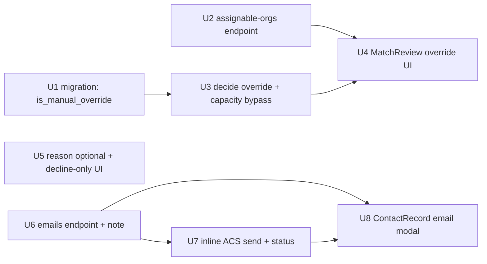

# feat: Match-review staff override, decline-only reasons, contact email composer

Three approved features for the staff app, bundled because they were requested
together and share the match-review / contact-record surfaces. The product
design is locked (interactive brainstorm, 2026-06-03); this plan defines **how**
to build it.

1. **Staff override** — let staff assign *any* active facilitator on the
   match-review screen, including orgs the algorithm filtered out (closes the
   override half of issue **#52**).
2. **Decline-only reasons** — the decision reason becomes optional everywhere
   and is only prompted when a staff member declines (sends back) a match.
3. **Contact email composer** — a "Send email" modal on an adopter/facilitator
   record that emails the contact and records the email as a note on the
   timeline.

Stack: FastAPI + SQLAlchemy 2 async + Alembic (`apps/api`), ARQ worker
(`apps/worker`), Next.js 15 App Router + MSAL (`apps/web`), generated TS
contracts (`packages/contracts`).

---

## Problem Frame & Scope

**Feature 1 — staff override.** Today `apps/web/src/components/MatchReview.tsx`
only offers the *scored* alternates (`match_attempt` rows with `rank` 2/3) via
`decide('route_elsewhere', attempt_id)`. There is no way to assign an org that
the hard filter removed (no coverage, at capacity) or that was never a
candidate. Staff need a full override with eyes-open warnings.

**Feature 2 — decline-only reasons.** The API already requires `reason_code`
*only* on `send_back` (`decide_match`, `apps/api/src/jp_adopt_api/routers/matches.py`);
`accept` and `route_elsewhere` do not. But the web UI always renders the reason
picker, and `WorkflowTransition.tsx` carries the same always-on field. The
product decision is: reason is **never required** (drop the one remaining 400)
and is only **shown** on the decline path.

**Feature 3 — contact email.** Notes are `activity_log` rows written by
`POST /v1/contacts/{id}/notes` (`add_contact_note`); there is no outbound email
from a record today. The only on-demand email path in the system is the
magic-link sender — API endpoint commits, then fires an inline ACS send via
FastAPI `BackgroundTasks` with a dev-fallback log when `ACS_CONNECTION_STRING`
is unset. Feature 3 **matches that pattern** rather than introducing a new
queue.

**In scope:** the three features above, their API + worker + web surfaces,
contracts regeneration, and tests.

**Out of scope / deferred:** see [Scope Boundaries](#scope-boundaries).

---

## Key Technical Decisions

- **KTD-1 — Override rides the existing `route_elsewhere` verb, not a new one.**
  Extend `DecideRequest` with an optional `facilitator_org_id` (mutually
  exclusive with `next_attempt_id`). The decision pipeline, capacity release of
  the prior match, and outbox event are already centered on `route_elsewhere`;
  reusing it keeps one decision path instead of forking a parallel "assign"
  endpoint.

- **KTD-2 — Overrides are flagged, not inferred.** Add a real
  `match.is_manual_override BOOLEAN NOT NULL DEFAULT false` column plus a
  `MatchAttempt` audit row with `filter_reason='manual_override'` and
  `score=NULL`. A flag (vs. reverse-engineering from a null score) makes
  override matches trivially queryable for audit/reporting and survives future
  scoring changes.

- **KTD-3 — Manual-override accept bypasses the capacity ceiling** *(confirmed
  with requester)*. `_try_increment_capacity` 409s at the ceiling today; for a
  match with `is_manual_override = true`, accept commits the slot even if it
  pushes `capacity_committed` past `capacity_total`. The override warning has
  already told staff the org is full — blocking accept would make at-capacity
  overrides cosmetic. Non-override accepts keep the hard ceiling.

- **KTD-4 — Reason becomes fully optional; UI gates visibility, not the API.**
  Remove the `reason_required` 400 in `decide_match`'s `send_back` branch. The
  column stays and still captures a reason when one is supplied. The web layer
  decides *when to ask* (decline only).

- **KTD-5 — Email matches the magic-link pattern, not the outbox.** The
  outbox/ARQ path is documented as *preferred* in code comments but is **not
  wired** for on-demand sends. Per "match what we have," the email endpoint
  writes the note in-transaction, commits, then fires
  `send_contact_email_inline` through `BackgroundTasks`. This inherits the same
  known durability gap as magic-link (process death between commit and send
  drops the email) — acceptable, and it can graduate to the outbox later
  alongside magic-link rather than inventing a one-off queue now.

- **KTD-6 — Sent emails are first-class notes.** The email is persisted as an
  `activity_log` row (`kind='email'`, `body` = message, `source_metadata =
  {subject, to[], status}`) so it appears in the existing timeline. The
  background send updates `source_metadata.status` to `sent` / `failed`.

- **KTD-7 — Follow repo conventions.** New API surface → `pnpm
  contracts:generate` (CI enforces the committed-artifact check). New column →
  new Alembic revision `0022` (never edit `0021`). Reason-code rendering stays
  on `humanizeReasonCode` from `apps/web/src/lib/vocab.ts`. Decision/teardown
  still flows through the match `decide` HTTP verb, not PATCH.

---

## System-Wide Impact

| Surface | Touched by | Notes |
|---|---|---|
| `match` table (new column) | F1 | Migration `0022`; additive, default false — safe |
| `MatchAttempt` audit rows | F1 | New `filter_reason` enum value `manual_override` |
| `match_or_route` capacity semantics | F1 | Override-only ceiling bypass; default path unchanged |
| `decide` API contract | F1, F2 | New optional field + relaxed validation → contracts regen |
| New `assignable-orgs` endpoint | F1 | Read-only; contracts regen |
| New `emails` endpoint | F3 | Write + background send; contracts regen |
| `activity_log` rows | F3 | New `kind='email'`; timeline already renders arbitrary kinds |
| `MatchReview.tsx`, `WorkflowTransition.tsx`, `ContactRecord.tsx` | F1, F2, F3 | UI changes; no web test harness yet (#31) |
| ACS / `ACS_CONNECTION_STRING` | F3 | Reuses magic-link ACS config + dev fallback |

---

## Implementation Units

Dependency order: U1 → U3 → U4; U2 → U4; U5 standalone; U6 → U7 → U8.



---

### U1. Migration + model: `match.is_manual_override` and `manual_override` filter reason

**Goal:** Persist whether a match was a manual staff override, and add the audit
filter-reason value.

**Requirements:** F1 (#52). Enables KTD-2.

**Dependencies:** none.

**Files:**
- `apps/api/alembic/versions/20260603_0022_match_manual_override.py` (new revision, down_revision `0021`)
- `apps/api/src/jp_adopt_api/models.py` (add `is_manual_override` to `Match`)
- `apps/api/src/jp_adopt_api/domain/matching.py` (add `FilterReason.MANUAL_OVERRIDE = "manual_override"`)
- `apps/api/tests/test_match_domain.py` (model/enum coverage)

**Approach:** Additive boolean column, `NOT NULL DEFAULT false`, no backfill
needed (existing matches are algorithmic). Add the enum member to the
`FilterReason` StrEnum. Do **not** edit `0021` (AGENTS.md hard rule).

**Patterns to follow:** Existing migrations under `apps/api/alembic/versions/`;
boolean-column adds like `accepting_potential_adopters` on `facilitating_org`.

**Test scenarios:**
- `alembic upgrade head` then `downgrade -1` round-trips cleanly on a fresh DB.
- A `Match` constructed without specifying the field defaults to `is_manual_override = False`.
- `FilterReason("manual_override")` resolves to the new member.

**Verification:** Migration applies on a fresh DB; `\d match` shows the column;
existing match tests still pass.

---

### U2. `GET /v1/matches/{match_id}/assignable-orgs`

**Goal:** Return every active non-triage org annotated with eligibility for this
match's interest, so the UI can present a full picker with warnings.

**Requirements:** F1 (#52).

**Dependencies:** none (reads existing orgs/coverage/capacity).

**Files:**
- `apps/api/src/jp_adopt_api/routers/matches.py` (new endpoint + response model)
- `apps/api/tests/test_matches_api.py`

**Approach:** Resolve the match → its `adopter_interest.people_id3`. Load active
`facilitating_org` where `is_triage_org = false` (reuse
`_load_facilitators_with_coverage` shape from `domain/matching.py`). For each
org compute `covers_fpg` (people_id3 ∈ coverage), `has_capacity`
(`capacity_committed < capacity_total`), and a `warning` ∈
{`no_coverage`, `at_capacity`, `null`} (coverage takes precedence when both
fail). Exclude the org already on the current match. Sort eligible-first, then
by name. Gate with the existing queue-decider role dep (`require_role` set used
by `decide_match`). Read-only — no writes, no outbox.

**Patterns to follow:** `admin.py` `FacilitatingOrgRead`/`FacilitatingOrgListResponse`
response-model shape; `_load_facilitators_with_coverage` for the coverage join.

**Test scenarios:**
- Returns all active non-triage orgs; the current match's org is excluded.
- An org covering the interest's `people_id3` with free capacity → `covers_fpg=true, has_capacity=true, warning=null`.
- An org not covering the FPG → `warning="no_coverage"`.
- An org at its ceiling (`capacity_committed == capacity_total`) → `warning="at_capacity"`.
- Org failing both → `warning="no_coverage"` (coverage precedence).
- Triage org and inactive org are omitted.
- Unknown `match_id` → 404; unauthorized role → 403.

**Verification:** Endpoint returns annotated list; appears in `openapi.json`
after `contracts:generate`.

---

### U3. Extend `decide` `route_elsewhere` for arbitrary-org override

**Goal:** Allow `route_elsewhere` to assign any active org by id, creating a
flagged override match plus an audit row, and let override accepts bypass the
capacity ceiling.

**Requirements:** F1 (#52). Implements KTD-1, KTD-2, KTD-3.

**Dependencies:** U1.

**Files:**
- `apps/api/src/jp_adopt_api/routers/matches.py` (`DecideRequest`, `decide_match` route_elsewhere + accept branches)
- `apps/api/tests/test_matches_api.py`

**Approach:**
- Add `facilitator_org_id: uuid.UUID | None = None` to `DecideRequest`. Extend
  the existing `model_validator` so `facilitator_org_id` is only valid with
  `decision='route_elsewhere'`, and reject supplying **both**
  `facilitator_org_id` and `next_attempt_id` (422).
- In the `route_elsewhere` branch: when `facilitator_org_id` is provided,
  validate the org exists, is active, and is non-triage (422/404 otherwise);
  mark the current match declined as today; create the new `recommended` Match
  pointing at the chosen org with `is_manual_override = true`; write a
  `MatchAttempt` row (`candidate_facilitator_id` = chosen org,
  `filter_reason='manual_override'`, `score=NULL`, `rank` = next after scored
  alternates) for audit. When `facilitator_org_id` is absent, behavior is
  unchanged (scored alternate / `next_attempt_id`).
- In the `accept` branch: when the match being accepted has
  `is_manual_override = true`, commit capacity unconditionally (skip the
  `_try_increment_capacity` ceiling guard / do an unguarded increment) so an
  at-capacity override can be accepted past `capacity_total`. Non-override
  accepts keep the existing ceiling guard and its `capacity_unavailable` 409.
- Emit the existing `routed_elsewhere` / accept outbox events via
  `emit_outbox()` (transactional-outbox convention).

**Technical design** *(directional, not implementation spec):*
```
route_elsewhere:
  if body.facilitator_org_id:
    org = load_active_nontriage(org_id) or 4xx
    decline(current_match)
    new = Match(interest, org, status='recommended', is_manual_override=True)
    audit = MatchAttempt(interest, org, filter_reason='manual_override', score=None, rank=next)
  else:
    <existing scored-alternate path>

accept:
  if match.is_manual_override and target == MATCHED:
    increment_capacity_unguarded(org)      # past ceiling allowed
  else:
    if not _try_increment_capacity(org): 409 capacity_unavailable
```

**Patterns to follow:** The current `route_elsewhere` block and
`_stamp_decision` / `_try_increment_capacity` helpers in `matches.py`; the
`uq_match_open_per_interest` "one open match per interest" invariant (decline
the old before inserting the new).

**Test scenarios:**
- `route_elsewhere` with `facilitator_org_id` for an org that covers + has
  capacity → new `recommended` match with `is_manual_override=true`; old match
  declined; one `manual_override` MatchAttempt row written.
- Override to a `no_coverage` org succeeds (override bypasses the filter) and is
  flagged.
- Override to an at-capacity org succeeds at decide time; subsequent `accept`
  commits capacity **past** `capacity_total` and does **not** 409.
- Non-override `accept` on an at-capacity org still 409s `capacity_unavailable`
  (ceiling preserved).
- `facilitator_org_id` + `next_attempt_id` together → 422.
- `facilitator_org_id` with `decision != route_elsewhere` → 422.
- `facilitator_org_id` pointing at a triage/inactive/unknown org → 4xx.
- Only one open match per interest after the override (invariant holds).

**Verification:** Override path produces a flagged match + audit row; capacity
semantics behave per KTD-3; `decide` contract regenerated.

---

### U4. MatchReview override UI

**Goal:** Add an "Assign a different facilitator" typeahead to the match-review
screen, with warning badges, that calls the override path.

**Requirements:** F1 (#52).

**Dependencies:** U2, U3. Run `pnpm contracts:generate` first so the new fields
exist in `packages/contracts`.

**Files:**
- `apps/web/src/components/MatchReview.tsx`
- `packages/contracts/src/generated/api.ts` (regenerated, committed)

**Approach:** Below the existing scored-alternates list, add a typeahead backed
by `GET /v1/matches/{id}/assignable-orgs`. Each option shows the org name and,
when `warning` is set, a badge ("No coverage" / "At capacity") rendered via the
vocab label helpers (no mechanical underscore-to-space). Selecting an org calls
`decide('route_elsewhere', { facilitator_org_id })`. On success, route back to
the queue as the existing decision flow does. Surface the `capacity_unavailable`
/ validation errors inline.

**Patterns to follow:** Existing `decide()` callback and alternates rendering in
`MatchReview.tsx`; `humanizeReasonCode`/`humanizeStatus` usage from
`apps/web/src/lib/vocab.ts`; existing API client calls.

**Test scenarios:** `Test expectation: none — no web test harness yet (#31)`.
Manual verification scenarios for the implementer:
- Picker lists non-recommended active orgs; at-capacity/no-coverage rows show a
  warning badge.
- Selecting a warned org completes the override and returns to the queue; the
  contact now shows the chosen org.
- Selecting a normal org behaves like a route-elsewhere.

**Verification:** On the local stack, override-assign a no-coverage org from
`/matches/[matchId]` and confirm the new recommendation; `contracts:generate`
leaves no uncommitted diff.

---

### U5. Reason optional everywhere; prompt only on decline

**Goal:** Make the decision reason fully optional and only ask for it when
declining.

**Requirements:** F2. Implements KTD-4.

**Dependencies:** none. Run `contracts:generate` if the response/validation
shape changes (it should not — the field is already optional in the schema).

**Files:**
- `apps/api/src/jp_adopt_api/routers/matches.py` (`decide_match` `send_back` branch — remove the `reason_required` 400)
- `apps/api/tests/test_matches_api.py`
- `apps/web/src/components/MatchReview.tsx` (render reason only on send-back; drop client "send_back requires a reason" guard)
- `apps/web/src/components/WorkflowTransition.tsx` (render reason only on the decline/`sent_back` path; drop its send-back guard)

**Approach:** Delete the `reason_required` HTTPException in the `send_back`
branch of `decide_match` so a send-back with no `reason_code` succeeds and
records a null reason. In both web components, conditionally render the reason
`<select>` (and notes field) only when the chosen action is decline/`send_back`,
and remove the client-side guards that block submission without a reason. Accept
and route-elsewhere show no reason UI.

**Patterns to follow:** The current conditional rendering and `decide()` guards
in `MatchReview.tsx` (lines around the `send_back requires a reason` check) and
`WorkflowTransition.tsx`.

**Test scenarios (API):**
- `send_back` with **no** `reason_code` → 200, match status `sent_back`,
  `decision_reason_code` null.
- `send_back` **with** `reason_code` → 200, reason persisted (still captured).
- `accept` and `route_elsewhere` with no reason → 200 (unchanged).
- Regression: a previously-passing send-back-with-reason test still passes.

**Test scenarios (web):** `Test expectation: none — no web test harness yet (#31)`.
Manual: reason picker hidden on accept/route-elsewhere; shown on decline; decline
submits with the field left empty.

**Verification:** API accepts reason-less send-back; UI only shows the reason
field on decline.

---

### U6. `POST /v1/contacts/{id}/emails` — endpoint + note record

**Goal:** Accept a composed email, persist it as a note, and trigger an inline
ACS send.

**Requirements:** F3. Implements KTD-5, KTD-6.

**Dependencies:** none.

**Files:**
- `apps/api/src/jp_adopt_api/routers/contacts.py` (new endpoint + request model)
- `apps/api/tests/test_contacts_record.py`

**Approach:** Request body `{ subject, body, include_secondary?: bool }`.
Resolve the contact (404 if missing). Recipients: `email_normalized`; if the
contact is a facilitator **and** `include_secondary` is true and
`secondary_contact_email` is set, add it. 422 if no primary email exists.
Write one `activity_log` row (`kind='email'`, `body` = message, `author_id` =
actor sub, `source_metadata = {subject, to: [...], status: 'queued'}`) and
`commit()` — so the note shows immediately. Then register the background send
(U7) via FastAPI `BackgroundTasks`, passing recipients, subject, body, the note
id, and the ACS settings — mirroring `request_link` in `auth_magic_link.py`.
Return the created note row (and recipients) to the caller. Gate with the staff
role dep already used by `add_contact_note` (`_STAFF_DEP`).

**Patterns to follow:** `add_contact_note` (`contacts.py`) for the
`activity_log` write + response model; `request_link` /
`_enqueue_send_factory` (`auth_magic_link.py`) for commit-then-BackgroundTasks
send; recipient fields on `Contact` (`email_normalized`,
`secondary_contact_email`, `party_kind`).

**Test scenarios:**
- Adopter with a primary email → 201, note row written `kind='email'`,
  `source_metadata.to` = [primary], status `queued`; background task scheduled.
- Facilitator with `include_secondary=true` and a secondary email → recipients
  include both addresses.
- Facilitator with `include_secondary=true` but no secondary email → sends to
  primary only (no error).
- `include_secondary=true` on an **adopter** → secondary ignored (adopter has no
  secondary contact).
- Contact with no `email_normalized` → 422 (no send, no note, or note marked
  `failed` per chosen contract — assert the chosen behavior).
- Unknown contact id → 404; unauthorized role → 403.
- The created note appears in the contact activity/timeline query.

**Verification:** Endpoint writes the note and schedules the send; visible in the
record timeline; present in `openapi.json` after regen.

---

### U7. `send_contact_email_inline` — ACS send + status update

**Goal:** Send the composed email through ACS (dev-fallback log) and stamp the
note's send status.

**Requirements:** F3. Implements KTD-5, KTD-6.

**Dependencies:** U6.

**Files:**
- `apps/worker/src/jp_adopt_worker/tasks/send_contact_email.py` (new `send_contact_email_inline`)
- `apps/api/tests/test_worker_send_contact_email.py` (new, mirrors `test_worker_send_magic_link_email.py`)

**Approach:** Model on `send_magic_link_email_inline`: lazy-import
`azure.communication.email.EmailClient`; when `acs_connection_string` is unset,
log a dev-fallback line and treat as a no-op *send* (still mark the note status
— see below); build plain + minimal HTML from the staff-supplied subject/body;
send to each recipient with the 30s `asyncio.to_thread` + `wait_for` timeout
guard. After the send attempt, update the note's `source_metadata.status` to
`sent` (or `failed` on exception/timeout) using a short-lived async session
(the function receives a session factory or DSN, since `BackgroundTasks` run in
the API process post-response). Sender = `ACS_SENDER_ADDRESS`; set reply-to to
the acting staff email when available.

**Execution note:** Start from a copy of `send_magic_link_email_inline`'s
structure; the only net-new behavior over magic-link is the post-send
`activity_log` status update — test that explicitly.

**Patterns to follow:** `apps/worker/src/jp_adopt_worker/tasks/send_magic_link_email.py`
(ACS client, lazy import, dev fallback, 30s timeout, capped retries);
`test_worker_send_magic_link_email.py` for the test harness (ACS stubbed).

**Test scenarios:**
- No `ACS_CONNECTION_STRING` → dev-fallback log fires, no ACS call; note status
  updated to `sent` (dev) or a documented dev sentinel — assert the chosen
  value.
- With ACS (client stubbed) and a successful send → note status `sent`,
  `message_id` recorded in `source_metadata`.
- ACS raises / times out → note status `failed`; function does not crash the
  request process.
- Multiple recipients (facilitator primary + secondary) → each addressed;
  status reflects overall outcome.

**Verification:** Worker email test passes with ACS stubbed; locally (no ACS),
sending an email logs the dev-fallback line and flips the note to a terminal
status.

---

### U8. ContactRecord "Send email" modal

**Goal:** Add the email composer modal to the adopter/facilitator record.

**Requirements:** F3.

**Dependencies:** U6 (and U7 for end-to-end). Run `contracts:generate` first.

**Files:**
- `apps/web/src/components/ContactRecord.tsx`
- `packages/contracts/src/generated/api.ts` (regenerated, committed)

**Approach:** A "Send email" button on the record opens a modal with **Subject**
and **Body** fields, and — only when the record's `party_kind` is
`facilitator` — an "Also send to secondary contact" checkbox. Submit calls
`POST /v1/contacts/{id}/emails`. On success, close the modal and refresh the
activity timeline so the new `kind='email'` note appears. Disable the button
when the contact has no email. Surface 422 (no email) / send errors inline.

**Patterns to follow:** Existing note composer + `addNote` callback and timeline
rendering in `ContactRecord.tsx`; the activity row rendering that already shows
arbitrary `kind` labels.

**Test scenarios:** `Test expectation: none — no web test harness yet (#31)`.
Manual:
- Adopter record: modal shows Subject + Body only (no secondary checkbox); send
  adds an `email` note to the timeline.
- Facilitator record with a secondary email: checkbox present; checking it sends
  to both; the note records both recipients.
- Contact with no email: button disabled (or 422 surfaced).

**Verification:** On the local stack, send an email from an adopter and a
facilitator record; both appear as email notes; `contracts:generate` leaves no
uncommitted diff.

---

## Scope Boundaries

### Deferred to Follow-Up Work
- **Graduate on-demand email to the transactional outbox** (durability) —
  applies to both magic-link and contact email; out of scope here per KTD-5.
- **Per-FPG / multi-interest override** — override currently targets the
  match's single interest; bulk override across a multi-FPG contact is not in
  scope.
- **Override audit reporting / admin view** — the `is_manual_override` flag and
  audit row are written now; surfacing an override report is later work.
- **Web test harness** — component tests for the three UI changes land when
  Vitest + RTL (#31) exists; flagged per-unit as `none — #31`.

### Non-Goals
- Changing the matching algorithm weights or scoring (the override *bypasses*
  scoring; it does not retune it).
- Rich-text / templated emails, attachments, threading, or inbound email.
- Auto-bumping `capacity_total` (rejected in favor of KTD-3's accept-time
  ceiling bypass).
- Re-introducing `adopter_status`/`facilitator_status` to PATCH (AGENTS.md).

---

## Risks & Mitigations

| Risk | Mitigation |
|---|---|
| Override past capacity ceiling skews `capacity_committed` vs `capacity_total` reporting | Intentional per KTD-3; the `is_manual_override` flag + audit row make over-ceiling commits explainable in reporting |
| Email send durability gap (process death between commit & send) | Accepted, matches magic-link; note persists with `status='queued'` so a stuck send is visible and re-sendable later |
| Background task can't update note status (session lifecycle in `BackgroundTasks`) | U7 opens its own short-lived session/engine; test the status-update path explicitly |
| Contracts drift breaks CI | `contracts:generate` is in each API unit's verification; UI units depend on the regenerated artifact |
| `manual_override` MatchAttempt with null score breaks queue/score readers | Scored alternates already tolerate null `score`; add a test asserting queue + match-attempt readers handle the override row |

---

## Verification Strategy

- **API:** `uv run pytest` in `apps/api` against a fresh local Postgres (the
  suite's seed data is not idempotent across repeated runs on one DB — recreate
  the DB for a CI-parity run). New/changed tests live in `test_matches_api.py`,
  `test_match_domain.py`, `test_contacts_record.py`, and the new
  `test_worker_send_contact_email.py`.
- **Contracts:** `pnpm contracts:generate` after U2/U3/U5/U6; commit the
  regenerated `packages/contracts` + `apps/api/openapi.json` (CI fails
  otherwise).
- **Migration:** `alembic upgrade head` + `downgrade -1` round-trip on a fresh
  DB.
- **Manual (local stack):** override-assign a no-coverage org and accept it past
  capacity; decline a match with no reason; send an email from an adopter and a
  facilitator record and confirm the timeline note + dev-fallback log.
