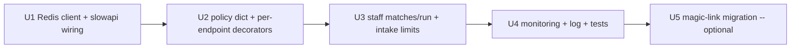

# Per-actor rate limiting infrastructure (#32)

Plan document for the rate-limiting feature, not the implementation
itself. Drops a clean design + sequencing on disk so when the work
picks up it doesn't restart from zero.

The "do nothing today" call is deliberate: at current production
traffic (one staff operator, one forms consumer, no public abuse
signal), the bespoke per-endpoint protections cover the real risk.
Building a shared infra layer is a v2 task that pays back when a
second consumer arrives or a public-form abuse pattern shows up.

---

## Problem Frame & Scope

Three categories of endpoints today have **no shared throttling
layer**:

1. **Mutating staff endpoints** — `POST /v1/matches/run/{contact_id}`
   in particular. `force=true` writes a `MatchAttempt` row per
   facilitator considered; repeated calls grow the audit table
   linearly. Staff_admin / adoption_manager role is the only gate.
2. **Public intake** — `POST /v1/intake/adoption` and `/v1/intake/facilitation`
   protected by `Idempotency-Key` dedup but no per-key/per-bearer
   throughput cap. A leaked or generous API key could pump
   submissions arbitrarily.
3. **Public magic-link** — `POST /v1/auth/magic-link/request` has
   email-based throttling via a bespoke `magic_link_rate_limit`
   table. Works, but is the only protection of its kind and isn't
   reusable.

**In scope:**
- One shared backend (Redis OR asyncpg-backed token bucket)
- Per-endpoint policy registration (limits + windows)
- Wired to `STRICT_AUTH=true` posture; dev-local bypass is fine in
  non-prod, never in prod
- Optional: migrate the magic-link bespoke limiter to the shared layer

**Out of scope:**
- DDoS-level protection (handled at ingress / CDN)
- Per-key scoping (which endpoints each intake key can call) —
  belongs to #59's v2

---

## Key Technical Decisions

### KTD-1 — Redis over asyncpg-backed token bucket

Redis is already in the stack (ARQ worker uses it for the job queue;
production has an Azure Cache for Redis instance). A token bucket
in asyncpg would land 5× more complexity (transaction isolation,
lock contention, cleanup of stale buckets) than a Redis SETEX-based
sliding window.

The "Redis is now a dependency for the API container" cost is
already paid by the worker — the API just gains a Redis URL env
var.

### KTD-2 — Use `slowapi` rather than hand-rolled middleware

[`slowapi`](https://github.com/laurents/slowapi) is the canonical
FastAPI rate-limit middleware. It's a thin adapter over `limits` (the
underlying token-bucket library used by Flask-Limiter), supports
Redis natively, integrates with FastAPI's decorator-on-route model,
and emits the standard `X-RateLimit-*` response headers.

Hand-rolled middleware buys nothing. The library is well-maintained,
~3 active contributors, no security CVEs in 2024-2026.

### KTD-3 — Policy is a constant dict in code, not a config file

Rate limits change rarely (this isn't feature-flag territory). A
dict in `apps/api/src/jp_adopt_api/rate_limits.py` keeps the policy
reviewable in PR diffs alongside the endpoints they protect.

### KTD-4 — Per-actor key derivation is endpoint-aware

- For staff endpoints: `f"staff:{user.sub}"`
- For intake: `f"intake_key:{api_key_id}"` (the 16-hex hash, not
  the plaintext)
- For magic-link: `f"magic_link:{email_hash}"`

This isolates noisy-neighbor scenarios: one staff member's runaway
script doesn't deny service to a different staff member; one leaked
forms key doesn't kill magic-link requests.

### KTD-5 — Reject responses use the unified error envelope

429 responses follow the convention in
`docs/solutions/conventions/error-envelope-2026-06-09.md`:

```json
{
  "detail": {
    "code": "rate_limited",
    "message": "Too many requests. Retry after 60 seconds.",
    "retry_after_seconds": 60
  }
}
```

Plus the standard `Retry-After` header.

### KTD-6 — Migration of magic-link's bespoke limiter is optional, sequenced last

The magic-link table-backed limiter works. Migrating it to the
shared Redis layer adds value (one limiter instead of two) but
isn't load-bearing. Land it in a follow-up after the shared infra
is exercised by intake + matches.

---

## Implementation Units



### U1. Redis client + slowapi wiring
- Add `slowapi>=0.1.9` to `apps/api/pyproject.toml`
- New `apps/api/src/jp_adopt_api/rate_limits.py`:
  - `Limiter` instance keyed on a custom function (KTD-4)
  - Redis storage URL from `settings.redis_url`
- Wire `limiter` into `main.py` via `app.state.limiter = limiter` +
  the standard slowapi exception handler that emits the 429 + headers

### U2. Policy dict
- `RATE_LIMITS: dict[str, str] = {...}` in `rate_limits.py`
- Per-endpoint values like `"30/minute"` (slowapi syntax)

### U3. Apply to staff matches + intake
- `@limiter.limit(RATE_LIMITS["matches_run"])` on
  `POST /v1/matches/run/{contact_id}` — start at `"10/minute"`
  per staff user
- `@limiter.limit(RATE_LIMITS["intake"])` on both intake routes —
  start at `"60/minute"` per intake_key_id (forms can easily peak
  here during onboarding events)

### U4. Monitoring + log + tests
- `logger.warning("rate_limit.exceeded", extra={...})` on every
  429 so we can grep production
- Optional: a `/v1/admin/rate-limits/recent` endpoint returning
  recent 429s for the last hour (out of scope unless it's
  desperately needed)
- Tests: integration test with a stub Redis (or use `fakeredis` in
  the API test harness — already a transitive dep via slowapi)

### U5. (Optional) Magic-link migration
- Drop the bespoke `magic_link_rate_limit` table queries
- Decorate `POST /v1/auth/magic-link/request` with `@limiter.limit`
- Migration to drop the table (Alembic revision)

---

## Test scenarios

- 10 rapid calls to `/v1/matches/run/{id}` from the same staff_sub
  return 200/200/200/.../429. The 11th call returns 429 with
  `Retry-After` populated.
- Same staff_sub on a DIFFERENT contact_id still consumes the same
  bucket (per-actor, not per-resource).
- Different staff_sub on the same endpoint has its own bucket.
- Dev-local bypass: when `STRICT_AUTH=false`, the limiter is
  installed but every request resolves to a stable
  `staff:dev-local` key. Don't disable the limiter outright; just
  exercise it.
- `fakeredis` stubs the Redis storage so tests run without a real
  Redis instance.

---

## Scope Boundaries

### Deferred to Follow-Up Work
- Per-key intake scoping (which endpoints each key can call)
- DDoS protection at the ingress
- Burst allowance vs sustained-rate distinction
- Per-IP throttling as a separate dimension

### Non-Goals
- Replacing FastAPI's built-in 422 validation paths
- Custom rate-limit-skip logic per user (no "premium tier"
  notion exists)
- Audit log of rate-limit decisions (the `logger.warning` line is
  enough)

---

## Why not today

- Single operator (Amy) + single intake consumer (jp-adopt-forms).
  No "noisy neighbor" pressure exists.
- `MatchAttempt` audit-table growth from `/v1/matches/run` is
  bounded by the org count + a per-attempt timestamp. At current
  scale, even a worst-case 1000 calls/day adds <50k rows/month — well
  within Postgres budget for the foreseeable future.
- Intake idempotency-key dedup catches retry storms.
- Magic-link table limiter catches credential-stuffing-for-emails.

The protections aren't perfect but they're sufficient for v1
operations. Building a shared infra layer **before** we hit a real
abuse signal would be premature — and #32 was deliberately filed
as a P2.

---

## When to revisit

Open this doc and start on U1 when any of:
- A second non-forms consumer arrives (n8n, ETL, partner integration)
- We see a public abuse pattern in forms or magic-link logs
- `MatchAttempt` table growth crosses a threshold that makes the
  weekly Postgres vacuum noticeable
- A new public-facing surface lands without its own per-endpoint
  protection (note this in the PR review)

---

## Closes

This plan closes the **design half** of #32. The implementation half
remains open until one of the trigger conditions above fires.
