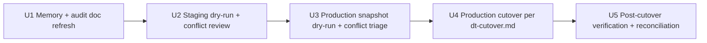

# DT contact import — execution

The Phase 2 line item from #91:

> Complete the DT → core contact-import ETL beyond the rop3-rename
> refactor done in #84/#85. … Also import legacy DT contacts that came
> in via channels other than the public forms (manual entry, partner
> outreach, etc.).

This plan covers **execution**, not (re)build. A pre-plan audit of the
existing ETL surface against the real DT MySQL schema flipped the
working assumption: the ETL is more done than the prior session note
suggested. The remaining work is verification, staging dry-run,
production cutover, and conflict triage.

---

## Audit Findings (2026-06-09)

The auto-memory note `dt-data-migration-status.md` (6 days old) claimed
the ETL is "mis-keyed against the real DT schema" — reads `type` not
`sub_type`, `country_code` not `form_country`, `origin` not `sources`,
`contact_email` not `contact_email_<hash>`, with an `adopter_interest`
stub reading empty `wp_p2p`, no `wp_dt_activity_log` import, and a
`--mode dry_run` that commits.

Audit of current `apps/etl/` against staging DT (40 contacts):

| Memory note | Current code state |
|---|---|
| `contacts` mapper mis-keyed | Uses `sub_type`, `name`, `overall_status`, `sources`. Comment at `apps/etl/src/jp_adopt_etl/mappers/contacts.py:31-34` explicitly: "Meta keys verified against the real DT instance — NOT the build-plan wishlist." |
| `adopter_interest` reads empty `wp_p2p` | `interests.py` reads `fpg_submission_data` postmeta JSON (the same shape the forms ETL uses). The orchestrator's `iter_p2p` call is still there but `wp_p2p` is empty (0 rows in staging) so it's a no-op. |
| `wp_dt_activity_log` never imported | `mappers/activity_history.py` exists, filters `action='field_update' AND object_type='contacts'`. |
| `--dry-run` commits | `orchestrator.py:878-961` captures pre-state, flushes, rolls back data writes, then replays audit rows (`migration_conflicts`, `etl_deleted_in_source`, `bulk_imported` outbox events) with fresh ids. Dry-run is rollback-safe. |
| `country_code` / `contact_email` keys | `profile.py` uses `form_country`. `channels.py` parses `contact_email_<hash>` (the DT comm-channel convention). |

Staging row counts (used to size the cutover):

| Source table | Rows | Notes |
|---|---|---|
| `wp_posts` (post_type='contacts') | 40 | The contacts to import |
| `wp_postmeta` (top keys: ministry_areas, sub_type, sources, overall_status, assigned_to, form_country, fpg_submission_data, contact_email_<hash>) | — | All expected mapper inputs present |
| `wp_users` | 4 | Staff identity links |
| `wp_comments` (on contacts) | 65 | Notes + inbound emails |
| `wp_dt_activity_log` (action='field_update', object_type='contacts') | 1,161 | Field-change history |
| `wp_p2p` | 0 | Confirmed empty — interests come from postmeta JSON |

Staging is anonymized; **production volumes are unknown until the
firewall is opened to that server**. Per `docs/runbooks/dt-cutover.md`
the cutover assumes a single Saturday afternoon window can absorb
multiples of these counts.

---

## Problem Frame & Scope

**In scope:**
- Validate the ETL against the real DT staging schema (live dry-run, not just unit tests)
- Add an Alembic migration if the audit surfaces a schema gap (currently none identified)
- Document any drift between staging and production schema observed during the prod dry-run
- Execute the production cutover per `docs/runbooks/dt-cutover.md`
- Triage `migration_conflicts` from the production dry-run before the final cutover

**Out of scope:**
- ETL rewrite (the existing mappers are correct against the schema we audited)
- Schema changes on jp-adopt-core (no gaps surfaced)
- Forms ETL (`mappers/forms.py`, run by forms#85 — already executed; this plan only touches the DT path)
- Replacing `dt-cutover.md` (it covers the operator sequence; this plan is the engineering prerequisite to that runbook)

---

## Key Technical Decisions

### KTD-1 — Treat the existing ETL as load-bearing; do not rewrite

The audit demonstrates the mappers are correct against the real schema.
Rewriting them risks regressing tested code (`apps/etl/tests/` carries
13 mapper test modules + an integration test). The cost of a fresh
implementation pays back only if the audit surfaces structural drift —
it did not.

### KTD-2 — Dry-run twice: staging, then production snapshot

Two dry-runs serve different purposes:

1. **Staging dry-run (anonymized, 40 contacts):** smoke the full pipeline
   end to end. Confirms mappers handle the real shape of postmeta values,
   not just fixture data.
2. **Production dry-run (against a fresh prod MySQL snapshot):** surface
   prod-specific data shapes — duplicate emails, unmapped status enums,
   `fpg_not_found`, `assignee_no_subject` — that staging doesn't have.
   This is where `migration_conflicts` triage happens before the
   write-freeze window starts.

### KTD-3 — Production cutover is operator-led, not pipeline-led

Per CLAUDE.md "Don't take risky actions… without confirmation," and per
`docs/runbooks/dt-cutover.md`, the production cutover (write freeze,
final snapshot, delta ETL, flag flip) is Joel's call to execute, with
this plan as the engineering prerequisite. The plan ships **the
engineering readiness**; the runbook ships **the operator readiness**.

### KTD-4 — Don't open prod firewall from this session

Audit was done against staging only. Reaching production MySQL needs a
firewall rule on `jp-mysql-flex-production` from Joel's operator IP,
not from a Claude session. The production dry-run runs in U2 from
Joel's machine.

### KTD-5 — Invalidate the stale memory note as part of this plan

The `dt-data-migration-status.md` memory drove a misleading mental
model into this session. Updating it to reflect the audit findings is a
deliverable, not a side-task — the next session that picks this up
should not re-discover the same audit.

---

## Implementation Units

### U1. Memory + audit doc refresh
- Update `~/.claude/projects/.../memory/dt-data-migration-status.md` to
  reflect the audit findings (ETL is keyed correctly, dry-run is safe).
- Capture this audit's raw findings inline in this plan (already
  present in the Audit Findings section above) so the plan itself is
  the source of truth — not a gitignored `.dt-inspection/` directory.
- **Execution note:** no code changes. Memory + plan only.

### U2. Staging dry-run + conflict review
- Open the staging MySQL firewall to Joel's operator IP (or reuse the
  existing `inspect-joel-mbpr` rule).
- Run `dt-etl --mysql-url <staging> --postgres-url <local-or-staging>
  --table all --mode dry_run --verbose` per `apps/etl/README.md`.
- Inspect `migration_conflicts` by `conflict_type`. Expected:
  `duplicate_email`, `assignee_no_subject`, `fpg_not_found`,
  `unmapped_status:*`.
- For any `unmapped_status:*`: add the mapping to
  `apps/etl/src/jp_adopt_etl/mappers/status.py` and re-run.
- For `fpg_not_found`: seed missing FPGs in the staging `fpg` table or
  document them as deferred (staging is anonymized — the `peopleId3`s
  may not exist anywhere real).
- Land any mapper fixes as a small PR.
- **Verification:** dry-run exits 0; `etl_run` row created; no
  unmapped_status conflicts remain.

### U3. Production snapshot dry-run + conflict triage
- Operator-led from Joel's machine (KTD-4): open
  `jp-mysql-flex-production` firewall to operator IP, run the same
  dry-run command pointed at the prod MySQL snapshot and local Postgres
  (or a staging Postgres restored from prod).
- Surface prod-specific `migration_conflicts` types that didn't appear
  in staging (real `assigned_to` users without B2C subjects;
  `duplicate_email` clusters from years of partner outreach; etc.).
- Decide per-conflict-type resolution:
  - `duplicate_email`: pick canonical contact post-cutover; ETL keeps
    the contact and nulls the duplicate's `email_normalized` (current
    behavior, per dt-cutover.md).
  - `assignee_no_subject`: re-run after the assignee signs in.
  - `fpg_not_found`: seed missing FPGs in `fpg` first.
- **Verification:** dry-run exits 0; conflict counts are
  triaged-and-documented or zero.

### U4. Production cutover per `dt-cutover.md`
- Follow `docs/runbooks/dt-cutover.md` step-by-step (14:00 write freeze
  → 14:15 final snapshot → 14:30 delta ETL → 15:00 verification queries
  → 16:00 flag flip → 17:00 announce).
- This plan does not duplicate the runbook; it points to it.
- **Verification:** row counts match MySQL source; `etl_run` shows
  `mode='production'`; `jp.adopt.v1.bulk_imported` outbox event emitted
  once.

### U5. Post-cutover verification + reconciliation
- Verify status distribution sanity (`SELECT adopter_status, COUNT(*) FROM
  contacts WHERE source_system='dt' GROUP BY 1`).
- Verify activity_log import (~1,200 field-change rows from staging
  baseline; production scales TBD).
- Verify the daily-digest pipeline finds the right recipients (the
  `contact_assignment` table is populated for staff who had assignments
  in DT).
- One-shot reconciliation between forms `dtSynced` history and core's
  `adopter_interest` to catch anything that fell between cracks during
  the dual-write window.
- **Verification:** Amy can open a real DT contact in jp-adopt-core,
  see their lifecycle status, see their interests, see the assignment.

---

## Test Scenarios

- **Staging dry-run end-to-end:** 40 contacts in,
  `migration_conflicts` populated, no exceptions, rollback verified
  (the contacts table count is unchanged after dry-run exits).
- **One-shot status mapping:** for any `unmapped_status:*` conflict, the
  fix lands a mapping in `mappers/status.py` + a unit test in
  `tests/test_status_mapper.py` covering the new enum value.
- **Idempotent re-run:** running dry-run twice in succession against
  the same staging snapshot produces 0 new `migration_conflicts` rows
  on the second pass (audit replay only adds the new run's audit
  rows).
- **Watermark resume:** running with `--watermark <iso8601>` returns
  only rows modified after the watermark (verified by comparing
  `rows_in` against an unbounded run).
- **Local-edit preservation:** insert a contact via API, run
  `--table contacts`, edit the contact via API (flipping
  `local_modified_after_import=true`), re-run ETL — the local edit is
  preserved (ON CONFLICT DO UPDATE WHERE clause holds).

---

## Scope Boundaries

### Deferred to follow-up work
- ETL admin endpoints (`feat/etl-admin-endpoints` worktree branch) —
  operator visibility into ETL runs; not blocking the cutover.
- D.T → core final delta sync after Day-1 production go-live.
- Replacing the gitignored `.dt-inspection/ASSESSMENT.md` with an
  in-repo audit doc (this plan captures enough; if the next pass needs
  deeper schema reference, add `docs/dt-schema-audit.md` then).

### Non-goals
- Rewriting the ETL — the audit demonstrates it is not needed.
- DT WordPress shutdown — separate operator task in #91's "DT
  decommission" section.
- Backwards-compat behavior in core for contacts that originated in DT
  — they're indistinguishable from forms-sourced contacts once imported
  (the `source_system` column lets ops differentiate).

---

## Risks

- **Production data shape unknowns:** staging is anonymized, so some
  unmapped enum values or duplicate-email clusters may only surface in
  U3. The dry-run-then-triage cycle absorbs this; the time cost is
  variable, hence Joel runs U3 on a calendar that allows iteration.
- **Stale auto-memory:** addressed by U1.
- **`dt-cutover.md` drift:** the runbook references migration `0025`
  but `0026` was added for intake API keys. The runbook's "expect 0025
  (head)" line will need bumping when this work executes — a one-line
  fix that can land alongside U2's mapper-fix PR.

---

## When this is done

- U1: memory updated; plan committed.
- U2: staging dry-run green; any mapper fixes shipped.
- U3: production dry-run green; conflict triage documented in a
  comment on #91 or in a follow-up issue.
- U4: cutover complete; `contacts WHERE source_system='dt'` rows match
  the source MySQL row count modulo documented conflicts.
- U5: Amy can navigate a real DT contact and its full history in
  jp-adopt-core.

Closes the **engineering half** of #91's "DT contact import" item.
The operator half (the actual cutover window) is closed by Joel's
execution of `docs/runbooks/dt-cutover.md`.
