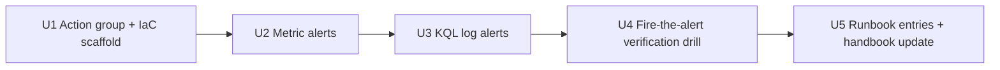

# Monitoring + alerting for jp-adopt-core production

#91's Phase 2 punch list calls out:

> Verify monitoring + alerting end-to-end: outbox drain lag, drip engine
> throughput, intake P50/P99, API health probes. Most of the alerting
> infra exists in `stacks/production/monitoring/jp-adopt-core/`; needs
> a "actually fires on staged outage" verification.

A 2026-06-10 audit against the production Azure subscription
contradicts the "most of the alerting infra exists" claim: **there are
zero production alerts on any jp-adopt-core resource**. The IaC
directory referenced may exist but has not been applied, or the
reference is aspirational.

This plan covers the audit findings, proposes a minimum viable alert
set patterned after the sibling JP services that already have
production alerting, and defines the "actually fires" verification.

---

## Audit findings (2026-06-10)

### Resources in `rg-jp-adopt-core-production`

```
jp-adopt-core-production                 (ACR)
id-jp-adopt-core-production              (User-assigned managed identity)
jp-adopt-core-api-production             (Container App)
jp-adopt-core-worker-production          (Container App)
jp-adopt-core-web-production             (Container App)
jp-adopt-etl-cron-production             (Container App Job)
```

### Alerts on those resources

```
az monitor metrics alert list \
  --query "[?contains(scopes[0], 'jp-adopt-core')].name" -o tsv
# (empty)

az monitor scheduled-query list \
  --query "[?contains(name, 'adopt-core')].name" -o tsv
# (empty)
```

**Zero metric alerts. Zero log-query alerts. Zero action groups.**

### Adjacent shared infrastructure (also no adopt-core-specific alerts)

| Resource | Alerts |
|---|---|
| `jp-postgresql-production` (shared with adopt_forms, n8n, link_hub, prayer_map) | One alert exists — `jp-prayer-map-pg-connections-production` — owned by prayer-map, not adopt-core. |
| `jp-container-env-production` (shared Container App env) | None. |
| `jp-adopt-core-kv-prod` (Key Vault) | None. |

### How peer JP services do this

Three peer services already follow a consistent alerting pattern:

| Service | Action group | Metric alerts | Log-query alerts |
|---|---|---|---|
| `jp-adopt-forms` | `jp-adopt-forms-alerts-production` → joel + tech@ | `http-5xx` (>10/5min), `healthcheck-degraded`, `healthcheck-down` | `console-crash-logs` |
| `jp-dt-platform` | `jp-dt-platform-alerts-production` → joel + tech@ | `healthcheck-down` | `console-crash-logs` |
| `jp-link-hub` | `jp-link-hub-alerts-production` → joel + tech@ | (none — log-only) | `pageSave-invariantFailure`, `cloudflarePurge-failureStreak`, `unlockLockout-spike`, `blobValidation-failed-rate`, `adminPagesV2-PUT-p95-high`, `beacon-4xx-rate-high` |

Pattern: **one action group per service** that emails the operator-of-record
+ a shared team distribution list. Alerts split into metric-based (Azure
emits the metric) and KQL-based (log-analytics scheduled query) depending
on what's available.

### Observability already in code (input to alert design)

| Signal | Where | Useful alert candidate |
|---|---|---|
| `logger.warning("rate_limit.exceeded", …)` | proposed in #32 design (not yet implemented) | Spike alert when implementation lands |
| `logger.warning("magic_link.email.permanent_failure", …)` | `auth_magic.py` | ACS quota / suppression detection |
| `outbox.processed_at` lag | DB | Worker stuck detection |
| `digest_run.status != 'sent'` | DB | Digest didn't fire |
| `drip_run.window_start` freshness | DB | Drip engine stuck |
| `GET /healthz` + `GET /readyz` | `apps/api` | Azure health probe |
| ACA container restart count | Azure platform metric | Crash loop detection |
| ACA HTTP 5xx rate | Azure platform metric | API regression detection |

---

## Problem Frame & Scope

**In scope:**
- Create an action group for `jp-adopt-core` mirroring the forms /
  dt-platform pattern (joel + tech@joshuaproject.net).
- Define a minimum viable alert set covering the four operational
  concerns from #91: outbox drain lag, drip engine throughput, intake
  P50/P99, API health probes.
- Verify each alert by triggering it in a controlled way.
- Add monitoring procedures to `docs/runbooks/operator-handbook.md`'s
  health-check section so operators know what to look at when an alert
  fires.

**Out of scope:**
- Application Insights wiring (separate decision — distributed tracing
  is not a P1).
- PostHog product analytics (ADR-010 holds; activation post-Day-10).
- Cost alerts (separate concern, handled by Azure subscription billing
  alerts).
- Rewriting log statements to be alert-friendly — the alerts proposed
  below work against what's already emitted.

**Where the IaC lives:**
The actual Terraform / Bicep belongs in `jp-infrastructure`, matching
the pattern for peer services (`stacks/production/monitoring/<service>/`).
This plan documents **what** needs to exist; the IaC PR happens in that
repo. The verification work (U3+) happens against the live Azure
resources from this repo's runbook.

---

## Key Technical Decisions

### KTD-1 — Mirror the peer-service alert pattern, do not invent a new one

The peer services have a coherent pattern: one action group per
service, severity-tagged alerts, email-based delivery. Going custom
(PagerDuty, Slack webhook, OpsGenie) without an operational reason
adds complexity. Email-based is sufficient for current scale
(single-operator).

### KTD-2 — Two alert tiers: page-worthy vs. visibility

| Tier | Examples | Notification |
|---|---|---|
| **Page** (severity 1) | API down (`healthz` failing), worker stuck (outbox drain lag > 5 min), Postgres unavailable | Email + (future) SMS |
| **Visibility** (severity 3) | Digest run failed, drip queue backed up, HTTP 5xx spike, ACA restart count > N | Email only |

Severity 0 (highest) reserved for actual data loss / security
incidents. Severity 2 reserved for sustained degradation that's not
yet down (P99 spikes, retry storms).

### KTD-3 — Page-worthy alerts must have a runbook entry

Every page-worthy alert needs a corresponding section in a runbook
naming what to do when it fires. If we cannot write a runbook for the
alert's response, the alert is wrongly tiered (it's visibility, not
page).

### KTD-4 — Verify each alert by triggering it, not by inspecting config

#91 calls this out explicitly: "actually fires on staged outage." For
each alert in U2 we identify a safe way to trigger it (synthetic
failure, controlled timeout, kill switch) and confirm:
1. The metric / log query crosses the threshold
2. The alert state transitions to "Fired"
3. The action group dispatches the notification
4. The notification reaches the recipient

Visual inspection of `az monitor metrics alert show` is not
verification — half the alerts in Azure are misconfigured (wrong
scope, wrong metric namespace, threshold off by 1000x). Triggering is
the only test that works.

### KTD-5 — Postgres alerts attach to the shared server, not to adopt-core

The Postgres server hosts five databases. CPU / connection / storage
alerts apply to the whole instance and benefit every consumer. They
should be owned by `jp-infrastructure` (the shared-infra repo), not by
adopt-core. This plan flags them but does not propose specific
thresholds — that's a `jp-infrastructure` decision.

---

## Implementation Units



### U1. Action group + IaC scaffold (jp-infrastructure)
- New Terraform module:
  `stacks/production/monitoring/jp-adopt-core/main.tf`
- One action group `jp-adopt-core-alerts-production` with email
  recipients (joel + tech@joshuaproject.net) matching peer services.
- Scaffold for the alert resources that U2 and U3 will fill in.
- **Verification:** `az monitor action-group show … -o table` returns
  the new group with both recipients listed.

### U2. Metric alerts (Azure platform metrics)
- **API healthcheck down** (severity 1) — ACA built-in
  `Replicas` metric on `jp-adopt-core-api-production` hits 0 for > 2
  minutes.
- **Worker healthcheck down** (severity 1) — same shape on
  `jp-adopt-core-worker-production`.
- **API HTTP 5xx spike** (severity 2) — Container App `Requests`
  metric filtered by `StatusCodeCategory=5xx`, threshold > 10/5min
  (matching forms).
- **API container restart count** (severity 2) — `RestartCount`
  metric > 3 in 15 minutes.
- **Worker container restart count** (severity 2) — same.
- **Postgres connection pressure** (severity 3) — owned by
  `jp-infrastructure`; this plan flags the gap, doesn't define the
  threshold.
- **Verification:** each fired by U4.

### U3. KQL log alerts (Log Analytics scheduled queries)
- **Outbox drain lag** (severity 1) — scheduled query against the
  `ContainerAppConsoleLogs_CL` table (or the structured logs table if
  one is configured). Either query the API's periodic outbox-status
  log line, or query `RestartCount`-style telemetry that maps to
  worker tick freshness. **Implementation-time question:** does the
  worker emit a periodic heartbeat log? If yes, query that; if no, add
  one in a small follow-up PR before landing this alert.
- **Digest run failure** (severity 3) — scheduled query for any
  digest_run row with `status != 'sent'` in the last 24 hours.
  Requires the worker to log digest outcomes (already does via
  `digest_run` table; this alert is the table-backed alternative if
  the log line is missing).
- **Magic-link permanent-failure rate** (severity 3) — count of
  `magic_link.email.permanent_failure` log lines > 5 in 1 hour.
- **API error log spike** (severity 3) — count of `level=ERROR` log
  lines > 50 in 5 minutes.
- **Verification:** each fired by U4.

### U4. Fire-the-alert verification drill
For each alert in U2 + U3, document and execute the trigger:

| Alert | Trigger |
|---|---|
| API healthcheck down | `az containerapp update --min-replicas 0` then wait. Restore after fire. |
| Worker healthcheck down | Same as above on worker. |
| API HTTP 5xx spike | `for i in $(seq 1 20); do curl -fsS "https://${API_FQDN}/v1/contacts" -H "Authorization: Bearer expired-token-…"; done` (assuming 401 returns 4xx, not 5xx — use a different endpoint that returns 500 on bad input, or skip and rely on natural fire). |
| Container restart count | Push a deliberately broken revision (set an invalid env var) — ACA cycles the replica. Roll back after fire. |
| Outbox drain lag | Pause the worker (`az containerapp update --min-replicas 0`) for 6+ minutes. Restore. |
| Digest run failure | One-off SQL: `INSERT INTO digest_run (window_start, status, …) VALUES (CURRENT_DATE, 'failed', …);` then revert (in-window). |
| Magic-link failure spike | One-off SQL inserting 6 synthetic log rows; or trigger 6 real magic-links with a known-bad target email. |
| API error log spike | Synthesize via the same one-off log-row insert pattern OR force a bug temporarily. |

Each trigger fills in:
- Timestamp of trigger
- Timestamp alert state transitioned to "Fired"
- Timestamp notification received in inbox
- Time-to-fire latency
- Any false alarms / collateral

Record the drill in a new
`docs/runbooks/monitoring-alert-verification-log.md` so the next quarterly
drill compares against this baseline.

### U5. Runbook entries + handbook update
- New `docs/runbooks/incident-response.md` covering each page-worthy
  alert: what to check first, where to look in logs, how to mitigate,
  how to escalate.
- Update `docs/runbooks/operator-handbook.md` "Health checks" section
  to point at the alert URLs in Azure Portal so the operator can
  validate the current alert state without re-running the CLI.

---

## Test scenarios

- **Action group dispatch test**: trigger any alert; both joel and
  tech@joshuaproject.net inboxes receive the email within 5 minutes.
- **Severity 1 latency**: API healthcheck-down fires within 2 minutes
  of the actual outage starting (per evaluation frequency PT1M +
  window PT2M).
- **No alert flap**: trigger the API 5xx spike alert; resolve;
  re-trigger 15 minutes later — both fires send separate
  notifications, not a debounce that swallows the second one.
- **Auto-resolution**: trigger any alert; remove the trigger;
  notification of resolution arrives within the configured eval
  window.
- **Cross-service isolation**: trigger an adopt-core alert; the
  adopt-forms action group does NOT receive a copy.

---

## Scope Boundaries

### Deferred to follow-up
- SMS notifications via the action group (requires phone numbers in
  Azure; deferred until single-operator on-call expands).
- PagerDuty / Slack integration (revisit when team grows).
- Custom application metrics via Azure Monitor Custom Metrics API (the
  built-in container-app metrics cover the current gap).
- Application Insights distributed tracing.
- Per-tenant alert routing.

### Non-goals
- Replacing the daily digest with alert-based event delivery (the
  digest is a product feature, not an ops tool).
- Alerting on every log line — the visibility-tier alerts above are
  the ceiling for now.
- Building a custom alerting UI in the staff app.

---

## Risks

- **Drill collateral**: a few of the trigger paths in U4 require taking
  the API briefly offline. Schedule the drill outside Amy's working
  hours and announce to the team.
- **Alert fatigue**: too many visibility-tier alerts will train the
  operator to ignore them. If U4 surfaces alerts that fire constantly
  from noise, tune thresholds before declaring U2 / U3 done.
- **KQL queries reference log tables that may not be configured**: ACA
  console logs land in `ContainerAppConsoleLogs_CL` by default but
  structured logs need an explicit log destination. Verify the
  destination during U3 before writing the queries.

---

## When this is done

- U1: action group exists in production, IaC committed in
  `jp-infrastructure`.
- U2: all proposed metric alerts deployed.
- U3: all proposed KQL alerts deployed.
- U4: every alert fired in a controlled drill; the verification log
  has an entry per alert; total drill time < 90 minutes.
- U5: incident-response runbook exists; handbook health-check section
  links to Azure portal alert state.

Closes #91's "Verify monitoring + alerting end-to-end" line item.
