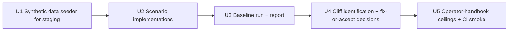

# Performance + load test plan for jp-adopt-core

#91's Phase 2 punch list calls out:

> Performance + load test against production-like data volume. The
> matching algorithm is the riskiest hot path; needs a load profile
> before real-world traffic.

This is **not** "make Postgres faster" — current traffic is tiny.
This is "find the cliff" — identify the data shape or concurrency
level at which a specific hot path falls over, so we can decide whether
to fix it pre-go-live or set a known-good operational ceiling.

---

## Production scale today (2026-06-10)

| Dimension | Current | Source |
|---|---|---|
| Total contacts | ~190 (182 backfilled from forms + manual) | #91 status update |
| Total matches | Single digits per week | Match-review queue, anecdotal |
| Intake submissions | < 1 / day, mostly from jp-adopt-forms | Production logs |
| Concurrent staff users | 1 (Amy) | Operational reality |
| Concurrent intake consumers | 1 (jp-adopt-forms) | Operational reality |
| Drip campaigns active | 0 (campaign authored but not activated) | DB |
| Worker tick frequency | 15 seconds | `apps/worker/src/jp_adopt_worker/worker_settings.py` |

**This is a single-tenant ops tool with batch-job semantics.** It does
not need to survive 1000 RPS. It needs to survive:
- A 1,701-FPG submission (Mission India's #87 stuck case) being
  unstuck and triggering match runs
- A weekly hour where Amy processes a batch of 20 recommendations
- The DT cutover importing ~thousands of legacy contacts and
  triggering per-contact match runs
- The daily digest computing across years of accumulated matches by
  year 3

The plan targets those four scenarios.

---

## Identified hot paths

### HP-1: `match_or_route(contact)` — per-contact match algorithm
- **File:** `apps/api/src/jp_adopt_api/domain/matching.py` (781 lines)
- **Complexity:** O(facilitators × interests) per call. Each interest
  loads every covering facilitator org via
  `_load_facilitators_with_coverage`, hard-filters, scores every
  candidate, writes one MatchAttempt row per candidate considered.
- **Concrete worst case observed:** Mission India submission has 1,701
  `fpg_selections`. If they all pass the FPG-coverage filter and there
  are F facilitator orgs covering each, the algorithm scores 1,701 × F
  candidates and writes 1,701 × F MatchAttempt rows (audit-table
  growth — #32's deferred concern).
- **Why it might cliff:** ORM session blow-up, MatchAttempt insert
  batch size, capacity-headroom calculation re-reading the same
  facilitator F times.

### HP-2: Intake POST `/v1/intake/adoption`
- **File:** `apps/api/src/jp_adopt_api/routers/intake.py`
- **Complexity:** Idempotency-key dedup (1 SELECT), authentication (DB
  lookup or env-var match), contact upsert (1 INSERT + 1 SELECT),
  outbox emit (1 INSERT).
- **Why it might cliff:** asyncpg pool exhaustion under burst,
  idempotency cache miss storm if the forms-side retry storms,
  `INTAKE_MAX_BODY_BYTES` clamp interacting badly with large
  `fpg_selections`.

### HP-3: Outbox drain (worker)
- **File:** `apps/worker/src/jp_adopt_worker/outbox_delivery.py`
- **Complexity:** Per 15s tick: `SELECT … FROM outbox WHERE
  processed_at IS NULL ORDER BY emitted_at LIMIT N FOR UPDATE SKIP
  LOCKED` → dispatch → update.
- **Why it might cliff:** Long-running webhook (HMAC sign + HTTPS
  POST) holds the row lock; if a downstream endpoint is slow, a 15s
  tick can fall behind faster than it catches up. The ETL's
  `outbox_suppressed()` shortcut exists to avoid filling the outbox
  during bulk import — that's the right answer for ETL, but it's not
  applied to match-run.

### HP-4: Daily digest computation
- **File:** worker function under `apps/worker/src/jp_adopt_worker/`
- **Complexity:** SELECTs against matches × contacts × users for the
  24h window + per-recipient email composition + ACS send.
- **Why it might cliff:** Worst case is "Amy has 5 years of data and
  the digest scans without a date index" — the query plan tips into a
  seq scan once the table exceeds a threshold. Most digests are
  one-shot once a day; latency is not the issue, correctness is.

### HP-5: Match queue page rendering
- **File:** `apps/api/src/jp_adopt_api/routers/matches.py` →
  `apps/web/app/matches/page.tsx`
- **Complexity:** GET `/v1/matches?status=recommended` → N rows + per-row
  contact/facilitator/score lookup. Today the API materializes everything
  the UI shows in one round trip.
- **Why it might cliff:** As accumulated matches grow, the default
  page-size eventually returns enough rows that the per-row JOINs cost
  meaningful CPU on the B1ms Postgres.

---

## Out of scope

- Microbenchmarks of individual scoring functions
  (`_capacity_headroom_score`, `_geography_score`). Profile if a cliff
  surfaces; don't pre-optimize.
- Front-end React render performance (the UI shows < 50 rows at a
  time; this is not a bottleneck).
- Network-level DDoS or SYN-flood resilience (#32 plan + Azure ingress
  cover this).
- Multi-region failover testing (no multi-region today).

---

## Key Technical Decisions

### KTD-1 — Use `k6` for HTTP-level load generation

`k6` is the load tool that already runs in CI for jp-adopt-forms (per
the deploy pattern across JP services). Single binary, JavaScript test
scripts, native support for ramp-up profiles, P50/P95/P99 reporting.
Locust / vegeta / wrk are alternatives but `k6` matches the local
toolchain.

For DB-level scenarios (HP-1 match algorithm against synthetic
contacts, HP-4 digest computation), use a Python script (`uv run
--package jp-adopt-api`) calling the function directly — there's no
HTTP layer between the load and the bottleneck, so don't pretend there
is.

### KTD-2 — Run against staging, not production

Production has 190 contacts and a single live operator. Loading
against it risks UI degradation for Amy. Staging Postgres is a
separate instance (`jp-postgresql-staging`) — load there.

Staging needs to be seeded with realistic data first (U1).

### KTD-3 — Define "passes" before running, not after

Each scenario in U2 has explicit pass criteria. If a run misses a
criterion, that's a finding (file an issue, decide fix-vs-accept). If
we run, see the number, then decide it's "fine," we're moving the
goalposts.

### KTD-4 — Find the cliff, not the floor

Each scenario ramps up to find the breaking point, not just "is
P95 < 500ms at 1 RPS." The output is a curve, not a single number.
Headline result: "match-run for a 100-FPG contact P95 climbs above
2s at concurrency 5; above concurrency 8 the worker outbox lag exceeds
60s."

### KTD-5 — Document the operational ceiling, even when no fix is shipped

If a cliff is identified and the decision is "don't fix," the ceiling
goes in `docs/runbooks/operator-handbook.md` as a known limit Amy
should respect (e.g., "don't trigger bulk re-match for > 10 contacts
at once in v1"). A known ceiling beats an unknown one.

---

## Implementation Units

### U1. Synthetic data seeder for staging
- New script `scripts/load-test-seed.py` that creates:
  - 5,000 contacts (4,000 forms-style with 1-3 fpg_selections, 1,000
    DT-style imported via the ETL pattern)
  - 50 facilitator orgs with realistic FPG coverage (each covering
    20-200 FPGs)
  - 100 staff users
  - One drip campaign with 5 steps + 500 enrollments
- Idempotent (re-runnable). Cleans up via `--reset`.
- Lands as a PR ahead of any scenario implementation; reviewed for
  data-shape realism.
- **Verification:** running the script populates staging without
  errors; `SELECT COUNT(*) FROM contacts` returns 5,000.

### U2. Scenario implementations
- **HP-1 scenarios** (Python, direct function call against staging DB):
  - 1-FPG contact: latency baseline
  - 10-FPG contact: typical-case
  - 100-FPG contact: stretch-case
  - 1,701-FPG contact: Mission India worst-case
- **HP-2 scenarios** (`k6`):
  - 1 RPS → 10 RPS over 5 min against `/v1/intake/adoption` with
    realistic payload sizes (small + large + the Mission India shape)
  - Idempotency-key collision test: same key 100x in 10s
- **HP-3 scenarios**: trigger match-run for 50 contacts in parallel,
  measure outbox accumulation + drain lag.
- **HP-4 scenarios**: trigger daily digest manually against the
  seeded staging DB; measure query plan and total elapsed time.
- **HP-5 scenarios** (`k6`): GET `/v1/matches?status=…` at staging
  scale; measure P95 latency at 1-, 10-, 100-row response sizes.
- **Verification:** scripts run; output a single JSON report per
  scenario with min/p50/p95/p99/max latency, error count, throughput.

### U3. Baseline run + report
- Run every scenario from U2 against the seeded staging.
- Emit a single Markdown report
  (`docs/load-test-baseline-2026-06-10.md`) with:
  - Date, staging row counts, tool versions
  - Per-scenario results vs. pass criteria
  - Identified cliffs (latency or error-rate inflection points)
- Pre-defined pass criteria:

| Scenario | Pass criterion |
|---|---|
| HP-1 1-FPG | < 100ms p95 |
| HP-1 10-FPG | < 500ms p95 |
| HP-1 100-FPG | < 5s p95 |
| HP-1 1,701-FPG | completes without OOM; documented elapsed (we accept it's slow) |
| HP-2 10 RPS | < 200ms p95, 0% errors |
| HP-2 idempotency 100x | < 100ms p95, all 200s after first |
| HP-3 50 parallel match-runs | outbox drain lag returns to <30s within 5 minutes after load stops |
| HP-4 daily digest | < 30s total |
| HP-5 100-row matches list | < 300ms p95 |

### U4. Cliff identification + fix-or-accept
- For each scenario that misses pass criteria, decide:
  - **Fix now** (file an issue, plan a follow-up PR) — for cliffs that
    will be hit at expected-near-term scale
  - **Accept + document ceiling** — for cliffs above the expected
    operational envelope; encoded in U5
- Likely candidates from current code shape:
  - HP-1's 1,701-FPG case will not pass cleanly without batched
    inserts on MatchAttempt — that's a real follow-up.
  - HP-3's outbox concurrency under 50 parallel match-runs may surface
    the row-lock contention noted in the hot-path analysis.

### U5. Operator-handbook ceilings + CI smoke
- Add known ceilings to `docs/runbooks/operator-handbook.md` (e.g.,
  "Don't bulk-trigger match-run for more than N contacts at once
  without coordination with Joel").
- Lightweight CI smoke: one HP-2 scenario at 1 RPS / 60s runs on every
  PR that touches `apps/api/src/jp_adopt_api/routers/intake.py`,
  failing the build if p95 regresses > 50%. **Implementation-time
  question:** can CI reach a load-test target without a deploy? If
  not, the smoke runs as a manual `workflow_dispatch` instead. (CI
  currently uses ephemeral Postgres + the test suite, not a deployed
  endpoint; defer the smoke to manual.)

---

## Test scenarios

These are the load scenarios themselves — described above in U2. The
"test scenarios" section in other plans corresponds to verification
tests; for a load-test plan, the scenarios ARE the work.

---

## Scope Boundaries

### Deferred to follow-up
- Real-user-traffic shadowing (route a fraction of prod traffic to
  staging — requires infra investment, not warranted today).
- Application Insights distributed tracing under load.
- Postgres query-plan analysis automation (build it if U3 surfaces
  multiple plan-tipping points).
- Multi-region or fail-over load tests.

### Non-goals
- Tuning matching weights based on load — weights are a product
  decision, not a perf decision.
- Replacing asyncpg or psycopg with a faster driver — switch costs
  exceed any plausible gain at current scale.
- Building a custom load-test framework when k6 exists.

---

## Risks

- **Staging is not a 1:1 of production**: the Postgres SKU
  (`Standard_B1ms`) is the same on staging and production, but the
  compute headroom on each varies with what else is running. Note
  observed neighbor activity in the U3 report.
- **Synthetic data is not real data**: edge-case shape that production
  has and the seeder doesn't will not surface in this plan. Re-run
  scenarios against any real prod-data snapshot when available.
- **Drift over time**: the baseline expires. Re-run quarterly (added
  to the operator-handbook quarterly cadence in #130).

---

## When this is done

- U1: seeder script committed; staging populated.
- U2: scenarios implemented; can be re-run.
- U3: baseline report committed; pass/fail clear per scenario.
- U4: any "fix now" cliffs filed as issues; any "accept" decisions
  documented.
- U5: operator-handbook ceilings updated; CI hook (or its
  workflow_dispatch alternative) wired in.

Closes #91's "Performance + load test" line item.
